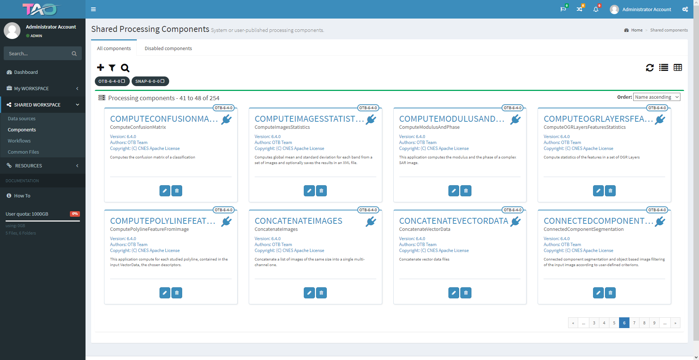
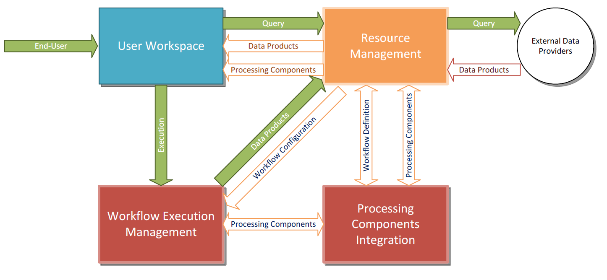

# Overview

# Context

CS Group responsabilities are as follow:
* Project owner and the master developer (master branch)
* Specification & Design
* Maintenance

The features are as follow:
* Visual integration of EO processing toolboxes
* A pre-defined set of Docker containers for Orfeo Toolbox, SNAP, GDAL and Python 2.7
* Visual definition of processing workflows by drag-and-drop and easy parametrization 
* Integration of user-defined algorithms in the processing workflows
* Visual definition of execution topologies
* Orchestrated execution of workflows such as Torque or SLURM
* Self-contained containerized execution on remote nodes
* Basic visual monitoring of executions and topology nodes resources

# Project implementation

The project objectives are as follow:
* TAO platform (stands for Tool Augmentation by user enhancements and Orchestration) is a lightweight, generic integration and distributed orchestration framework.

| Characteristic 	| Value |
|----------------	|-------|
| Start				| Mon Jul 17 02:00:00 CEST 2017 |
| End				|  |
| Duration 			| Since 2017 (2,6 years) |
| Workload			| 0 men x months |

The processes for carrying out the project are:
* Software V-Model

# Technical characteristics

The solution key points are as follow:
* Spring Framework
* A simple view of the TAO platform model split among four main macro-components

The main techonlogies are as follow.

COTS, Libraries: PostgreSQL, SNAP, Orfeo Toolbox, Slurm, Torque
Software for production: Git, Docker
License: GPL-3.0
OS: Linux
Main languages: Java, Python
