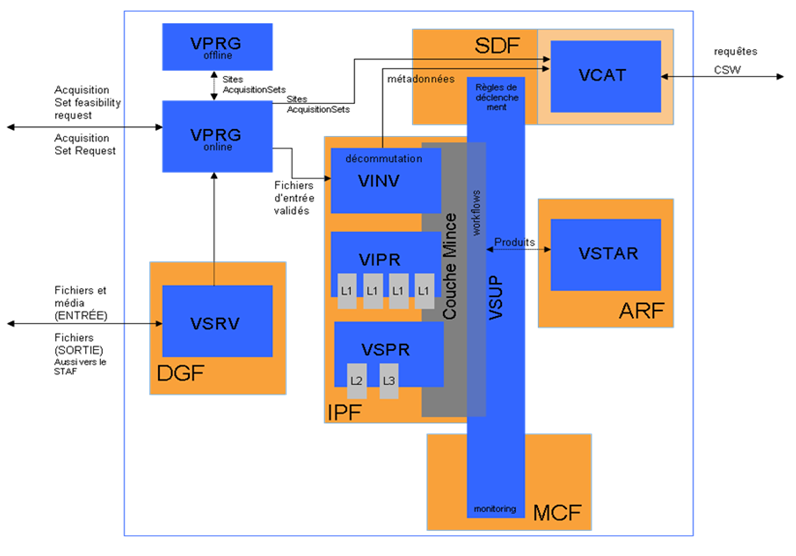

# Overview

# Context

CS Group responsabilities are as follow:
* Maintenance of the data center (VIP), the distribution server (VPDS), the qalification and operation support tools within the VEnµS ground segment

The features are as follow:
* Upgrade of COTS, image libraries and missions used by the center,
* Functional validation of the VIP center and VPDS,
* Integration of the PDS component developed by ACS, 
* VIP Integration / Validation,
* Dimensioning of the hardware architecture and its upgrade,
* QT/QO phase support,
* Evolutive and Corrective maintenance during the mission,

# Project implementation

The project objectives are as follow:
* Delivering an operational VIP/VPDS image processing center that takes into account the constraints of the VENµS mission during the operational phase.

| Characteristic 	| Value |
|----------------	|-------|
| Start				| Wed Jan 01 01:00:00 CET 2014 |
| End				| Mon Jan 01 01:00:00 CET 2018 |
| Duration 			| 4,0 years |
| Workload			| 132 men x months |

The processes for carrying out the project are:
* Development and continuous integration (coding/unit tests)

# Technical characteristics

The solution key points are as follow:
* Integration of the MACCS (image processor level L2/L3°) component,
* The image chain has taken into account the processing of stray light in the image processing chain (level L1).

The main techonlogies are as follow.

COTS, Libraries: LAI (Euclide, POLLUX, MARIO, GDAL  ..), PHRLIB , MSLIB
License: CNES Property
OS: Linux  CentOS 6.5
Formats & Protocols: XML
Main languages: JAVA,JAVASCRIPT, C,C++, Python, PHP, SQL, SWING, ksh,HTML
