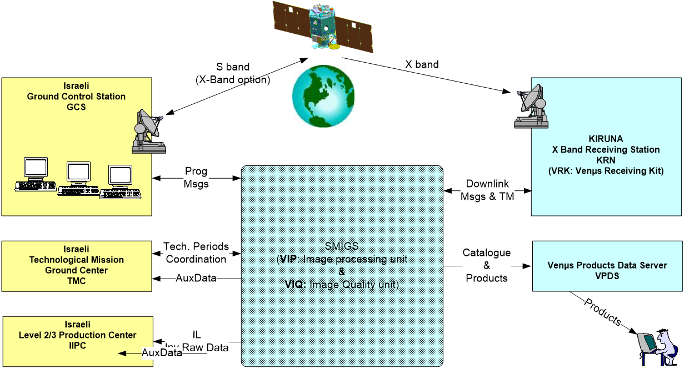

> __Customer__\: Centre National d'Etudes Spatiales (CNES)

> __Program__\: Venμs

> __Supply Chain__\: CNES >  CS Group PDA

# Context

VENμS mission (Vegetation and Environment on a New Micro-Satellite) should be launched in 2016 and should last 4 years, on an israelian satellite platform.
The mission objectives are :
* Demonstration of observation possibilities  with a superspectral optical instrument of 12 bands and an observation repetition of 2 days 
* Qualification of Israeli Hall Effect Thruster Electric Propulsion System (IHET) with orbit change and control to low altitude (410 km) during the last mission phase 
French scientists (CESBIO) and Israeli scientists (Ben Gourion University – BGU) lead the scientific mission and represent the concerned international community.
For the technological mission, ISA is associated with Israeli industrial partners.

CS Group responsabilities are as follow:
* Definition of mission model data and interfaces with the processing centre 
* Specification & Design & Development
* Integration in the CNES hosting structure
* Maintenance

The features are as follow:
* Command & Control system (GCS) based in Israel
* Receiving station for X band (VRS) in Kiruna
* SMIGS (Scientific Mission Image Ground System) in CNES, composed of VIP and VIQ
* Image processing centre VIP
* Image quality centre VIQ
* Product distribution server (VPDS)
* L2 and L3 production and distribution centre (IIPC) in Israel
* Technology mission centre (TMC) in Israel

# Project implementation

The project objectives are as follow:
* Facilitates the geometric and radiometric calibration tasks, the improvement and update of calibration parameters, the verification of the VENμS instrument performances
* Generates the reference DEM used in L1.

The processes for carrying out the project are:
* Development of radiometric and geometric calibration and validation methods
* Integration and configuration of CNES components, including the hosting platform

# Technical characteristics

The solution key points are as follow:
* Distributed system for database, catalog, and processing tasks on virtual machines
* Performant system for 6TB of data and 7 years of operation with heavy processing tasks
* Modules for easy evolution for client/server integration and processor/data integration in the hosting structure

The main technologies are as follow.

{:class="table table-bordered table-dark"}
| Domain | Technologie(s) |
|--------|----------------|
|Hardware environment(s)|HP servers and PC|
|Operating System(s)|Linux|
|Programming language(s)|Python, Java, J2EE/WS, HTML|
|Interoperability (protocols, format, APIs)|XML|
|Main COTS library(ies)|SNAP, GDAL, Orfeo Toolbox, Postgres, PostGIS, Tomcat, ENVI, CNES SAG (Structure d’Accueil Générique), CNES SIGMA|
