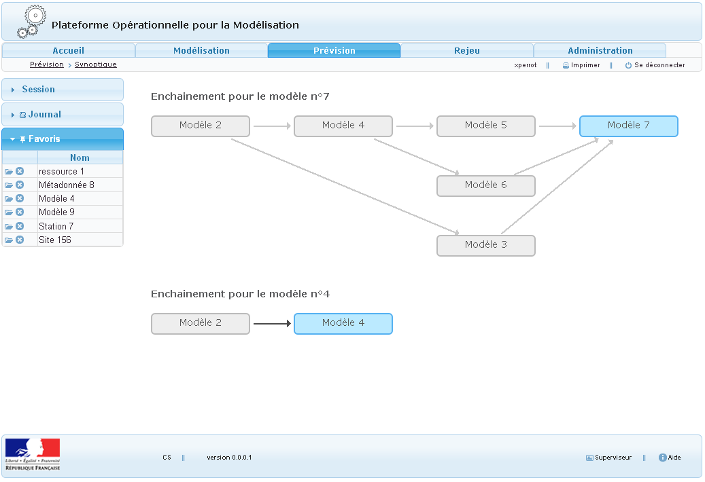

> __Customer__\: Service Central d'Hydrométéorologie et d'Appui à la Prévision des Inondations (SCHAPI)

> __Programme__\: Risk Management

> __Supply Chain__\: SCHAPI >  CS Group PDA

# Context

Since 2003, the SCHAPI has been coordinating the tools related to real-time flood forecasting at the national level. It also plays a role of expertise and support for the 22 French SPC (Flood Forecasting Services) on the use of these tools and the exploitation of the results.
For several years, a national software base has been developed to facilitate the daily exchange and supervision of forecasting data. The POM (Plateforme Opérationnelle pour la Modélisation), distributed nationally, is part of this perspective of pooling resources.

CS Group responsabilities are as follows:
* System specification and design
* Development
* Deployment of the system in SCHAPI and SPCs
* Training
* Maintenance

The features are as follows:
* Declaration of models and associated data (input and output)
* Forecasting programming, supervision and real-time control
* Replaying the past for training, comparison or feedback purposes

# Project implementation

The project objectives are as follows:
* The heterogeneity of the different forecasting calculation models makes their chaining complex.
* The objective of the POM is to facilitate the interoperability of the processing chains required to forecast water levels in real time.

The processes for carrying out the project are:
* Incremental V Cycle

# Technical characteristics

The solution key points are as follows:
* The architecture model is Client Server (n-tier) with a thin client.
* The POM system plays the role of scheduler and gateway but not of calculation engine.
* It includes batch mechanisms.
* The graphic chart is adaptable.
* The XML formats are standardized and versioned.

The main technologies used in this project are:

{:class="table table-bordered table-dark"}
| Domain | Technology(ies) |
|--------|----------------|
|Operating System(s)|Linux|
|Programming language(s)|Php 5.3|
|Interoperability (protocols, format, APIs)|XML|
|Main COTS library(ies)|PostgreSQL 9, Symfony2, Doctrine2|

{::comment}Abbreviations{:/comment}

*[CLI]: Command Line Interface
*[IaC]: Infrastructure as Code
*[PaaS]: Platform as a Service
*[VM]: Virtual Machine
*[OS]: Operating System
*[IAM]: Identity and Access Management
*[SIEM]: Security Information and Event Management
*[SSO]: Single Sign On
*[IDS]: intrusion detection
*[IPS]: intrusion prevention
*[NSM]: network security monitoring
*[DRMAA]: Distributed Resource Management Application API is a high-level Open Grid Forum API specification for the submission and control of jobs to a Distributed Resource Management (DRM) system, such as a Cluster or Grid computing infrastructure.
