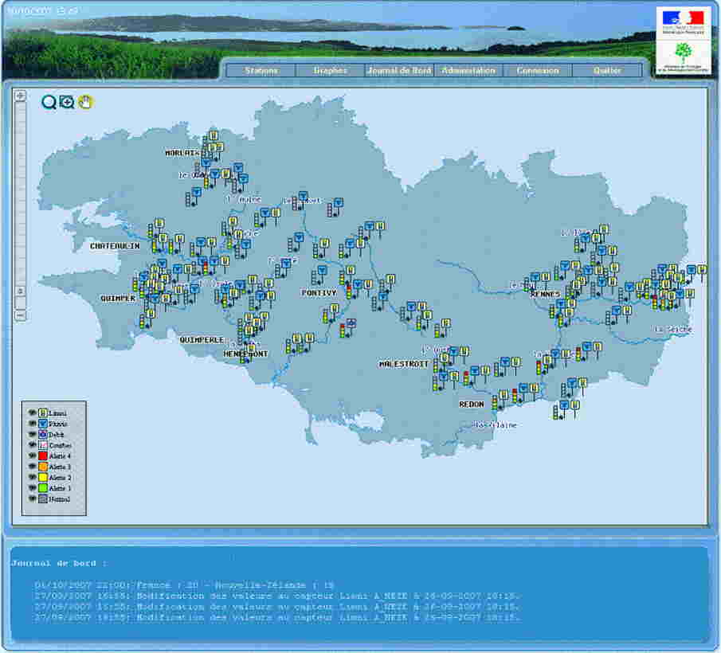
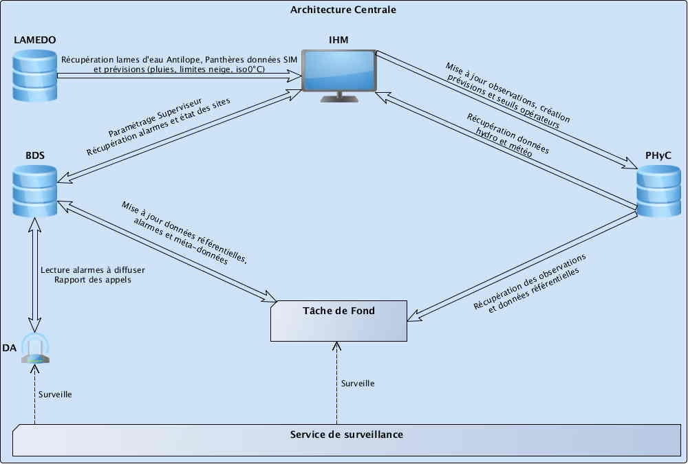

> __Customer__\: Service Central d'Hydrométéorologie et d'Appui à la Prévision des Inondations (SCHAPI)

> __Programme__\: Risk Management

> __Supply Chain__\: SCHAPI >  CS Group PDA

# Context

Le Superviseur National est utilisé quotidiennement, dans des situations potentiellement stressantes avec des intérêts économiques et humains majeurs.
Cette criticité impose des contraintes fortes de fiabilité, de performances, d'ergonomie et facilité d’utilisation

CS Group responsabilities are as follows:
* System specification and design
* Development
* Deployment of the system in SCHAPI and SPCs
* Training
* Maintenance

The features are as follows:
* Customized maps display for hydrologolical situation follow up 
* Hydrologolical data visualisation with tables and graphics. Data analysis function.
* Database access through WebServices
* Alarms management and automatic call to on duty personal.
* Remote acces through Web technologies.
* Sites multi-criteria search (alert level, name, river, hydro conditions)
* Advanced management function of the desktop
* log book, events book
* Forcasts display

# Project implementation

The project objectives are as follows:
* la supervision des données hydrométriques et météorologiques, sous forme cartographique, graphique et de tableaux.
* la visualisation des prévisions issues de modèles et la création d'expertise
* la gestion des alarmes hydrologiques, techniques et système

The processes for carrying out the project are:
* Incremental V Cycle

# Technical characteristics

The solution key points are as follows:
* The architecture model is Client Server (n-tier) with a thin client.
* Main components are :
	 *  Man Machine Interface (MMI)
	 *  Background tasking service 
	 *  Alarms Diffusion
	 *  Supervisor Database management
	 *  Monitoring Service

The main technologies used in this project are:

{:class="table table-bordered table-dark"}
| Domain | Technology(ies) |
|--------|----------------|
|Operating System(s)|Linux|
|Programming language(s)|Php 5.3, JAVA, C|
|Interoperability (protocols, format, APIs)|XML|
|Production software (IDE, DEVOPS etc.)|SVN|
|Main COTS library(ies)|PostgreSQL, PostGIS, PostgreSQL , Mapserver, pMapper|

{::comment}Abbreviations{:/comment}

*[CLI]: Command Line Interface
*[IaC]: Infrastructure as Code
*[PaaS]: Platform as a Service
*[VM]: Virtual Machine
*[OS]: Operating System
*[IAM]: Identity and Access Management
*[SIEM]: Security Information and Event Management
*[SSO]: Single Sign On
*[IDS]: intrusion detection
*[IPS]: intrusion prevention
*[NSM]: network security monitoring
*[DRMAA]: Distributed Resource Management Application API is a high-level Open Grid Forum API specification for the submission and control of jobs to a Distributed Resource Management (DRM) system, such as a Cluster or Grid computing infrastructure.
