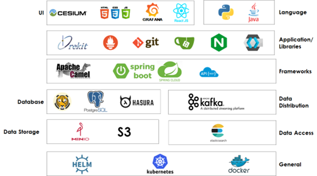

> __Customer__\: Absolut Sensing (ABSOLUT SENSING)

> __Programme__\: GESAT

> __Supply Chain__\: ABSOLUT SENSING >  CS Group SPACE

# Context

Abolut Sensing, Absolut System, CS Group France

CS Group responsabilities for GESAT ground segment implementation with GOSMIC are as follows:
* Development of ground segment for GESat mission based on our GOSMIC product line (CSNano, MAPS, OREFLIDS)

The features are as follows:
* Filing acquisition requests, drawing up the mission plan for each satellite, sending and calculating TCs, receiving TM, calculating manoeuvres, etc.

# Project implementation

The project objectives are as follows:
* CS develops for the GESat mission (constellation of 24 sat aims at measuring the greenhouse gas emissions to prevent and detect gas leaks and enable an intelligent ecological transition) the GS based on GOSMIC PL.
* This project will enable to have a 1st operational instance of GOSMIC PL.

The processes for carrying out the project are:
* Continuous integration, DevOps, DevSecOps, GitFlow

# Technical characteristics

The solution key points are as follows:
* Micro-service architecture, Kubernetes, METIS, API REST

The main technologies used in this project are:

{:class="table table-bordered table-dark"}
| Domain | Technology(ies) |
|--------|----------------|
|Hardware environment(s)|Cloud, S3, Minio|
|Operating System(s)|Linux, Windows|
|Programming language(s)|Java, Spring, Springboot, ReactJs|
|Interoperability (protocols, format, APIs)|Maven, Docker file, yaml|
|Production software (IDE, DEVOPS etc.)|SonarQube, Git, Maven, Jira, Tuleap, Jenkins|
|Main COTS library(ies)|NGINX, Docker, ElasticSearch, Grafana, Kafka, Keycloak, Loki, MongoDB, PostgreSQL, Spring Cloud, Spring Cloud Data Flow, Hasura, Cesium, Orekit, Helm, Kubernetes, Docker|

{::comment}Abbreviations{:/comment}

*[CLI]: Command Line Interface
*[IaC]: Infrastructure as Code
*[PaaS]: Platform as a Service
*[VM]: Virtual Machine
*[OS]: Operating System
*[IAM]: Identity and Access Management
*[SIEM]: Security Information and Event Management
*[SSO]: Single Sign On
*[IDS]: intrusion detection
*[IPS]: intrusion prevention
*[NSM]: network security monitoring
*[DRMAA]: Distributed Resource Management Application API is a high-level Open Grid Forum API specification for the submission and control of jobs to a Distributed Resource Management (DRM) system, such as a Cluster or Grid computing infrastructure.
