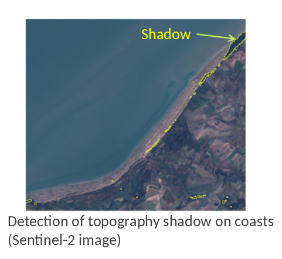

> __Customer__\: European Space Agency (ESA)

> __Programme__\: SEOM S2-4Sci Land and Water - Atmospheric corrections for coastal and inland water

> __Supply Chain__\: ESA > ACRI-ST >  CS Group SPACE

# Context

CS Group responsabilities for Mask of clouds and shadows for Sentinel-2 are as follows:
* Method for detecting clouds and their shadows
* Relief shadow detection method   
* Integration of the operational chain under SNAP

The features are as follows:
* **Cloud and shadow detection :**
*     Adaptation of FMASK for Sentinel-2
*     Test on a selection of Sentinel-2 images
	**Location of relief shadows :**
*     Development of the tool
*     Using the Rugged Library
*     Test on images
	**Documentation: A.T.B.D., DPM, Interfaces.**

# Project implementation

The project objectives are as follows:
* The project aims to develop a chain of atmospheric corrections in a coastal environment, including the detection of clouds and shadows, as well as glitter.
* Integrate the channel into SNAP.

The processes for carrying out the project are:
* Study, development, regular meetings

# Technical characteristics

The solution key points are as follows:
* Developments adapted to SNAP

The main technologies used in this project are:

{:class="table table-bordered table-dark"}
| Domain | Technology(ies) |
|--------|----------------|
|Operating System(s)|Linux|
|Programming language(s)|Python|
|Main COTS library(ies)|FMASK, Rugged|

{::comment}Abbreviations{:/comment}

*[CLI]: Command Line Interface
*[IaC]: Infrastructure as Code
*[PaaS]: Platform as a Service
*[VM]: Virtual Machine
*[OS]: Operating System
*[IAM]: Identity and Access Management
*[SIEM]: Security Information and Event Management
*[SSO]: Single Sign On
*[IDS]: intrusion detection
*[IPS]: intrusion prevention
*[NSM]: network security monitoring
*[DRMAA]: Distributed Resource Management Application API is a high-level Open Grid Forum API specification for the submission and control of jobs to a Distributed Resource Management (DRM) system, such as a Cluster or Grid computing infrastructure.
