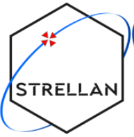

> __Customer__\: Centre National d'Études Spatiales (CNES)

> __Programme__\: STRELLAN

> __Supply Chain__\: CNES > ACTIA >  CS Group SPACE

# Context

With the rise of nano- and micro-satellite platforms, the constraints weighing on the functionality responsible for generating PVT on board a satellite, namely the GNSS receiver, are accumulating.| The increase in the capacity of current SoCs, in particular those identified as “NewSpace” or “nanosat”, makes it possible today to produce multi-constellation and multi-frequency GNSS receivers, but the filling rate remains despite this – and the remained in the short/medium term – important. Thus, GNSS receivers based on these COTS SoCs always have significant power consumption, and integrated systems, such as integrated avionics, are then strongly constrained by the resources required by the GNSS receiver functionality.| There is in fact a challenge in the optimization of GNSS receivers, including autonomous ones, to achieve a low MCV balance but with state-of-the-art PNT performance, but also in the development of highly integrated systems implementing a such optimized GNSS receiver function. These elements raise the need to develop a new range of GNSS receivers based on proven COTS components implementing GNSS processing and making it possible to achieve the performances expected by satellite platforms and their customers.

CS Group responsabilities for STRELLAN WP2 are as follows:
* Software Development

The features are as follows:
* Desing and development of the EM of a new range of space GNSS receivers based on a COTS GNSS module, called STRELLAN.|
* The main objective is the development of a very competitive product compared to the competition. It is required that this product be compatible with a high production rate.

# Project implementation

The project objectives are as follows:
* Development of flight software for STRELLAN equipment

The processes for carrying out the project are:
* V Cycle

# Technical characteristics

The solution key points are as follows:
* Oscillator with GNSSDO type architecture

The main technologies used in this project are:

{:class="table table-bordered table-dark"}
| Domain | Technology(ies) |
|--------|----------------|
|Programming language(s)|C|

{::comment}Abbreviations{:/comment}

*[CLI]: Command Line Interface
*[IaC]: Infrastructure as Code
*[PaaS]: Platform as a Service
*[VM]: Virtual Machine
*[OS]: Operating System
*[IAM]: Identity and Access Management
*[SIEM]: Security Information and Event Management
*[SSO]: Single Sign On
*[IDS]: intrusion detection
*[IPS]: intrusion prevention
*[NSM]: network security monitoring
*[DRMAA]: Distributed Resource Management Application API is a high-level Open Grid Forum API specification for the submission and control of jobs to a Distributed Resource Management (DRM) system, such as a Cluster or Grid computing infrastructure.
