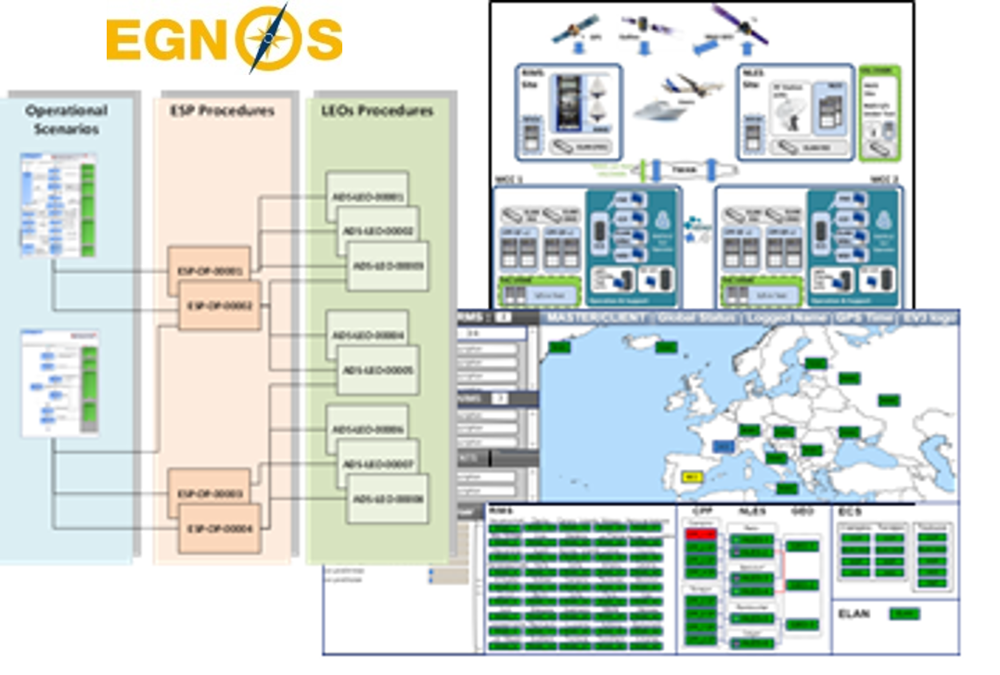

> __Customer__\: Airbus Defence & Space (ADS)

> __Programme__\: EGNOS

> __Supply Chain__\: ADS >  CS Group SPACE

# Context

CS Group responsabilities for Operation and maintenance of the EGNOS system are as follows:
* Development

The features are as follows:
* Production of operational and maintenance scenarios
* Production of operational and maintenance LEO procedures (Library EGNOS Operation)
* Participation in the design of the supervisor MMI mockup
* Participation in documentation review during different steps of subsystems (KO, PDR, CDR…)

# Project implementation

The project objectives are as follows:
* Engineering support for operation and maintenance preparation of EGNOS V3 system.

The processes for carrying out the project are:
* V Cycle

# Technical characteristics

The solution key points are as follows:
* European context: ADS, ESA, EUSPA
* EGNOS V2 service provider collaboration
* Planning and complex project

The main technologies used in this project are:

{:class="table table-bordered table-dark"}
| Domain | Technology(ies) |
|--------|----------------|
|Production software (IDE, DEVOPS etc.)|MEGA HOPEX: modélisation de scénarios opérationnels, génération doc.
DOORS: rédaction des exigences, génération doc.
PMOT: traçabilité points ouverts
Gestion de projet ECLIPSE: RIDS, traçabilité des actions
CONTEXT/LATEX: rédaction de procédures opérationnelles, génération doc.|

{::comment}Abbreviations{:/comment}

*[CLI]: Command Line Interface
*[IaC]: Infrastructure as Code
*[PaaS]: Platform as a Service
*[VM]: Virtual Machine
*[OS]: Operating System
*[IAM]: Identity and Access Management
*[SIEM]: Security Information and Event Management
*[SSO]: Single Sign On
*[IDS]: intrusion detection
*[IPS]: intrusion prevention
*[NSM]: network security monitoring
*[DRMAA]: Distributed Resource Management Application API is a high-level Open Grid Forum API specification for the submission and control of jobs to a Distributed Resource Management (DRM) system, such as a Cluster or Grid computing infrastructure.
