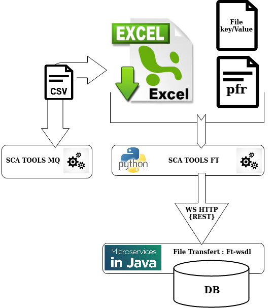

> __Customer__\: Airbus Defense & Space Geo (ADS-GEO)

> __Programme__\: Geo Digital System

> __Supply Chain__\: ADS-GEO >  CS Group SPACE

# Context

CS Group responsabilities for Common service of File Transfer involved in the Geo Digital System (GDS) of Airbus DS Geo are as follows:
* MCO corrective, MCO, Reversibility

The features are as follows:
* Reading configuration parameters for units and routes from the Excel file
* Settings the value of configuration parameters units and routes (pfr files) in the Excel file
* Create, delete  units (Source, Target) in the File Transfer database
* Create, delete routes in the File Transfer database
* Check consistency values of parameter sent by uses cases
* Display actions and errors provided by the tool.
* Excel file allows to create a CSV file in to order to configure the breakdown protrocol, used in the SCA TOOLS MQ tool

# Project implementation

The project objectives are as follows:
* **SCA TOOLS FT allows to configure File File Transfer in order to realize big data exchanges (files, tree) between sub-components of GDS service and other services of system. This tool creates or deletes units (Source, Target) and routes in the database of File Transfer**
*     Using a Excel  specific file with SCA TOOLS FT (input process).

The processes for carrying out the project are:
* Continuous integration

# Technical characteristics

The solution key points are as follows:
* RestFull web services
* Ease of use : Excel file
* Automatic Test
* object oriented Conception : **Railway Oriented Programming**

The main technologies used in this project are:

{:class="table table-bordered table-dark"}
| Domain | Technology(ies) |
|--------|----------------|
|Operating System(s)|Linux|
|Programming language(s)|Python, CURL, JSON, VisualBasic (Excel), bash, makefile|
|Production software (IDE, DEVOPS etc.)|Visual Studio Code, Emacs, Eclipse, Testlink, make, Excel|
|Main COTS library(ies)|pip, xlrd, string, requests, responses, configparser, pytest, pyinstaller|

{::comment}Abbreviations{:/comment}

*[CLI]: Command Line Interface
*[IaC]: Infrastructure as Code
*[PaaS]: Platform as a Service
*[VM]: Virtual Machine
*[OS]: Operating System
*[IAM]: Identity and Access Management
*[SIEM]: Security Information and Event Management
*[SSO]: Single Sign On
*[IDS]: intrusion detection
*[IPS]: intrusion prevention
*[NSM]: network security monitoring
*[DRMAA]: Distributed Resource Management Application API is a high-level Open Grid Forum API specification for the submission and control of jobs to a Distributed Resource Management (DRM) system, such as a Cluster or Grid computing infrastructure.
