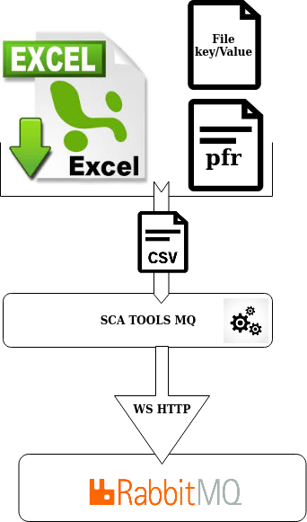

> __Customer__\: Airbus Defense & Space Geo (ADS-GEO)

> __Programme__\: Geo Digital System

> __Supply Chain__\: ADS-GEO >  CS Group SPACE

# Context

CS Group responsabilities for Common service involved in the Geo Digital System (GDS) of Airbus DS Geo are as follows:
* MCO corrective, MCO, Reversibility

The features are as follows:
* Reading configuration parameters to create vhosts, exchanges, queues, shovels from a CSV file generated by the the Excel file
* Settings the values of configuration parameters vhosts, exchanges, queues, shovels  (pfr files) in an Excel file
* Creating users with their rights and vhosts, exchanges, queues in the Rabbit MQ in order to realize uses cases
* Configuration of elements to create in the Rabbit MQ thanks to configuration files
* Check consistency values of parameter sent by uses cases
* Display actions and errors provided by the tool

# Project implementation

The project objectives are as follows:
* **SCA TOOLS MQ allows to configure automatically instances of broker message Rabbit MQ in order to realize inter-zones exchanges (secure, private, public) between different components**
* Communication by WebService of orders to create elements for the Rabbit MQ broker thanks to its API in Https.
* Using with a Excel file specific SCA TOOLS MQ (input)

The processes for carrying out the project are:
* Continuous integration

# Technical characteristics

The solution key points are as follows:
* RestFull web services
* Ease of use : Excel file

The main technologies used in this project are:

{:class="table table-bordered table-dark"}
| Domain | Technology(ies) |
|--------|----------------|
|Operating System(s)|Linux|
|Programming language(s)|Bash, JSON, VisualBasic (Excel)|
|Production software (IDE, DEVOPS etc.)|Excel, CURL, jq, Visual Studio code, Eclipse, Testlink|
|Main COTS library(ies)|RabbitMQ|

{::comment}Abbreviations{:/comment}

*[CLI]: Command Line Interface
*[IaC]: Infrastructure as Code
*[PaaS]: Platform as a Service
*[VM]: Virtual Machine
*[OS]: Operating System
*[IAM]: Identity and Access Management
*[SIEM]: Security Information and Event Management
*[SSO]: Single Sign On
*[IDS]: intrusion detection
*[IPS]: intrusion prevention
*[NSM]: network security monitoring
*[DRMAA]: Distributed Resource Management Application API is a high-level Open Grid Forum API specification for the submission and control of jobs to a Distributed Resource Management (DRM) system, such as a Cluster or Grid computing infrastructure.
