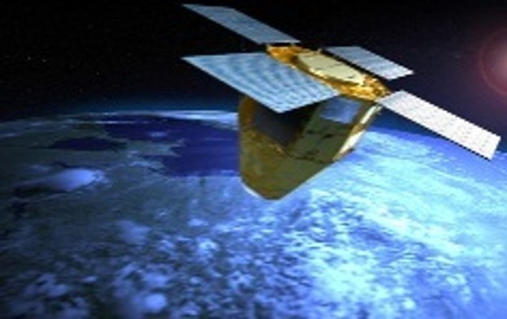

> __Customer__\: Airbus Defence & Space (ADS)

> __Programme__\: CSO

> __Supply Chain__\: ADS >  CS Group SPACE

# Context

CS Group responsabilities for Development of the CSO user soil segment are as follows:
* Package project carried out in consortium with Diginext subcontractor of CS Group

The features are as follows:
* IHM
* Request server
* Mission server 
* Cartographic

# Project implementation

The project objectives are as follows:
* Participation in specification phases
* Analysis of specifications and design of mission software components
* Component development
* Mission software validation
* Participation in SSU system validation
* MCO of the Mission software

The processes for carrying out the project are:
* V Cycle

# Technical characteristics

The solution key points are as follows:
* IHM modeling/prototyping with end users throughout the development cycle

The main technologies used in this project are:

{:class="table table-bordered table-dark"}
| Domain | Technology(ies) |
|--------|----------------|
|Hardware environment(s)|Serveurs HP Linux, PC Windows|
|Operating System(s)|Cent OS 6.5, Windows 8.1|
|Programming language(s)|Java, JavaFX, C++, SQL, bash (linux), PowerShell (Windows)|
|Production software (IDE, DEVOPS etc.)|Eclipse RCP|
|Main COTS library(ies)|PostGrès, PostGIS, GeoServer, VirtualGeo, Hibernate, Wildfly|

{::comment}Abbreviations{:/comment}

*[CLI]: Command Line Interface
*[IaC]: Infrastructure as Code
*[PaaS]: Platform as a Service
*[VM]: Virtual Machine
*[OS]: Operating System
*[IAM]: Identity and Access Management
*[SIEM]: Security Information and Event Management
*[SSO]: Single Sign On
*[IDS]: intrusion detection
*[IPS]: intrusion prevention
*[NSM]: network security monitoring
*[DRMAA]: Distributed Resource Management Application API is a high-level Open Grid Forum API specification for the submission and control of jobs to a Distributed Resource Management (DRM) system, such as a Cluster or Grid computing infrastructure.
