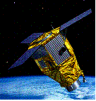

> __Customer__\: Centre National d'Etudes Spatiales (CNES)

> __Programme__\: Pléiades

> __Supply Chain__\: CNES > AIRBUS DS >  CS Group SPACE

# Context

CS Group responsabilities for TMA Pleiades programming channel are as follows:
* Liability in co-contracting, prime contractor

The features are as follows:
* Programming Unit: Image requests, Prog., Reception stations
* Access Unit: User access interface
* DUPC UNIT: Satellite commands, Cu data
* PCME UNIT: International Defense Programming 
* Processing unit: TMI inventory and archiving
* ImagereceIVINGSTATION UNIT: TMI reception and ingestion
* Accuratitudedatarestoration unit: fine attitude data
* Commandcontrol Unit: System and satellite settings
* Integration of Mission Phrlib/Gotlib Mission Bookstores

# Project implementation

The project objectives are as follows:
* Development: engineering phases, software specifications, preliminary and detailed design, coding and unit tests, unit and AIV validation, recipe, warranty,
* MCO: Correction of anomalies and development of many functional developments.

The processes for carrying out the project are:
* V Cycle

# Technical characteristics

The solution key points are as follows:
* Architecture strongly deployed, more than 200 XML file interfaces, web services
* Complexity of mission algorithms, performance requirements
* Civil duality/Defense
* Floor operating time of 25 years

The main technologies used in this project are:

{:class="table table-bordered table-dark"}
| Domain | Technology(ies) |
|--------|----------------|
|Operating System(s)|Linux, XP|
|Programming language(s)|C++, Java|
|Production software (IDE, DEVOPS etc.)|Oracle spatial, SIG OpenMap, Web Services, Apache Tomcat, Apache Axis, Kerbéros/LDAP ,Java web start, Xerces|
|Main COTS library(ies)|45 cots|

{::comment}Abbreviations{:/comment}

*[CLI]: Command Line Interface
*[IaC]: Infrastructure as Code
*[PaaS]: Platform as a Service
*[VM]: Virtual Machine
*[OS]: Operating System
*[IAM]: Identity and Access Management
*[SIEM]: Security Information and Event Management
*[SSO]: Single Sign On
*[IDS]: intrusion detection
*[IPS]: intrusion prevention
*[NSM]: network security monitoring
*[DRMAA]: Distributed Resource Management Application API is a high-level Open Grid Forum API specification for the submission and control of jobs to a Distributed Resource Management (DRM) system, such as a Cluster or Grid computing infrastructure.
