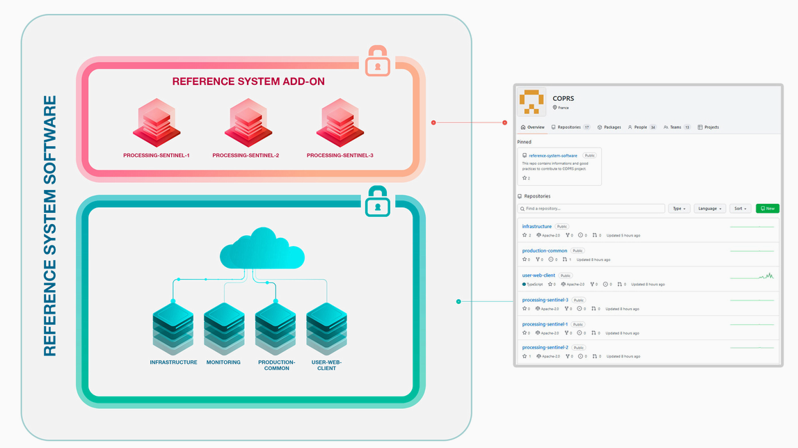
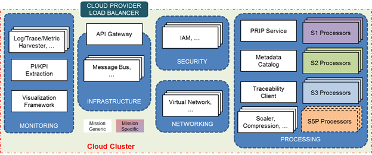

> __Customer__\: European Space Agency (ESA)

> __Programme__\: Copernicus

> __Supply Chain__\: ESA > AIRBUS DS >  CS Group SPACE

# Context

ESA, Airbus DS, Werum, CS Group Romania, CS Group France

CS Group responsabilities for ESA CSC Reference System (RS) are as follows:
* Development of infrastructure, monitoring and Sentinel 2 processing chain ; IVV for all satellites ; Setup of the Github collaborative platform ; Support to Operations

The features are as follows:
* The Reference System Service performs 3 operational functions: Systematic production and distribution service; Ad hoc production and distribution service; Environment to provide testing, integration, validation, benchmarking of Sentinel data processors
* IVV of all developments: Infrastructure / Monitoring / Security / Production chain S1, S2 and S3

# Project implementation

The project objectives are as follows:
* The RS is a key component of the CSC Ground Segment: it provides to the community a complete and open source processing and distribution environment software. 
* Integrated with the Sentinel Data Processors, it has the capacity to substitute the nominal CSC Production and Distribution services.

The processes for carrying out the project are:
* Agile, Continuous integration, DevOps, DevSecOps, GitFlow, Licence compliance

# Technical characteristics

The solution key points are as follows:
* Event Driven Architecture
* Micro service architecture
* Vendor Independent Deployment Solution
* Hardened Kubernetes platform
* Access and identity management
* Indicator management (PI/KPI)
* High Performance Logs & Audit
* SIEM

The main technologies used in this project are:

{:class="table table-bordered table-dark"}
| Domain | Technology(ies) |
|--------|----------------|
|Hardware environment(s)|Cloud, K8S|
|Operating System(s)|Linux Ubuntu|
|Programming language(s)|Java, Go|
|Interoperability (protocols, format, APIs)|Maven, Docker file, K8s yaml|
|Production software (IDE, DEVOPS etc.)|Safescale, VS Code, GitHub, Artifactory, Helm, Kubernetes, ZenHub, Ansible, Codacy, Trivy, SonarQube|
|Main COTS library(ies)|Apache Apisix, Blackbox Exporter, Calico, ClamAV, Curator, Docker, ElasticSearch, Falco, Fluentbit, Fluentd, Grafana, Graylog, Kafka, Keycloak, Loki, MongoDB, OpenLDAP, PostgreSQL, Prometheus, Rook Ceph, Spring Cloud, Spring Cloud Data Flow, Stash, Suricata, Thanos, Wazuh|

{::comment}Abbreviations{:/comment}

*[CLI]: Command Line Interface
*[IaC]: Infrastructure as Code
*[PaaS]: Platform as a Service
*[VM]: Virtual Machine
*[OS]: Operating System
*[IAM]: Identity and Access Management
*[SIEM]: Security Information and Event Management
*[SSO]: Single Sign On
*[IDS]: intrusion detection
*[IPS]: intrusion prevention
*[NSM]: network security monitoring
*[DRMAA]: Distributed Resource Management Application API is a high-level Open Grid Forum API specification for the submission and control of jobs to a Distributed Resource Management (DRM) system, such as a Cluster or Grid computing infrastructure.
