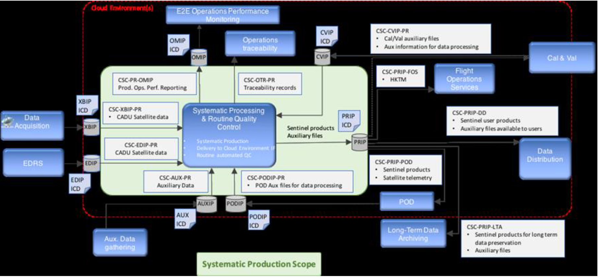
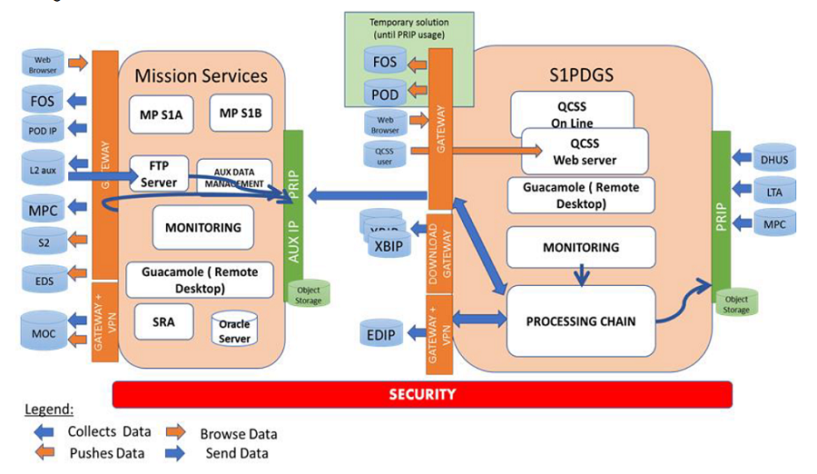

> __Customer__\: European Space Agency (ESA)

> __Programme__\: Copernicus

> __Supply Chain__\: ESA > AIRBUS DS >  CS Group SPACE

# Context

ESA, Airbus DS, Werum, CS Group France

CS Group responsabilities for AUXIP of Sentinel-1 hosting the Mission  Planning and SRA  subsystems are as follows:
* Development of data circulation services; Infrastructure; Security ; Maintenance

The features are as follows:
* The infrastructure layer (Cloud provider, VMs)
* The platform layer (Kubernetes/Docker)
* The security (SIEM, agents, IAM, reverse proxy)
* The monitoring (log&trace collection, ElasticSearch, Kibana/Grafana, Prometheus)
* The basic services (databases, Kafka queues)
* The processing elements (transfer from FS to Object Storage, ingestion clients, PRIP, zipping, ...)
* Maintenance in Operational Condition ; Working hour ; 3 levels of SLA : Blocking (2d) / Urgent (5d) / Routine (no SLA)

# Project implementation

The project objectives are as follows:
* Ingestion of Auxiliary files from various sources with associated security
* File Transformation for S1PDGS processing
* Publication of files with interface for S1PDGS ingestor
* File transfer from external source to external target (Sentinel 1 routing)
* Hosting Mission Planning and SRA applications and their exchanges

The processes for carrying out the project are:
* Agile, Continuous integration, DevOps, DevSecOps, GitFlow, Licence compliance

# Technical characteristics

The solution key points are as follows:
* **Massive reuse of the S1PDGS architecture**
* Event-Driven Architecture & Micro-service Architecture
* Vendor-agnostic deployment solution
* Hardened Kubernetes Platform
* Access and identity management
* Indicator management (PI/KPI)
* High performance logs & audit
* SIEM

The main technologies used in this project are:

{:class="table table-bordered table-dark"}
| Domain | Technology(ies) |
|--------|----------------|
|Hardware environment(s)|Cloud, K8S|
|Operating System(s)|Linux CentOS|
|Programming language(s)|Java, Go|
|Interoperability (protocols, format, APIs)|Maven, Docker file, K8s yaml|
|Production software (IDE, DEVOPS etc.)|Safescale, VS Code, Jenkins, Helm, Kubernetes, SonarQube; Harbor, Jira, Confluence|
|Main COTS library(ies)|Blackbox Exporter, Calico, ClamAV, Curator, Docker, ElasticSearch, Fluentbit, Fluentd, FreeIPA, Grafana, Graylog, Harbor, Kafka, Keycloak, Kibana, Kong, MongoDB, OpenVAS, PostgreSQL, Prometheus, Rclone, Spring Boot, Stash, Suricata, Thanos, Wazuh|

{::comment}Abbreviations{:/comment}

*[CLI]: Command Line Interface
*[IaC]: Infrastructure as Code
*[PaaS]: Platform as a Service
*[VM]: Virtual Machine
*[OS]: Operating System
*[IAM]: Identity and Access Management
*[SIEM]: Security Information and Event Management
*[SSO]: Single Sign On
*[IDS]: intrusion detection
*[IPS]: intrusion prevention
*[NSM]: network security monitoring
*[DRMAA]: Distributed Resource Management Application API is a high-level Open Grid Forum API specification for the submission and control of jobs to a Distributed Resource Management (DRM) system, such as a Cluster or Grid computing infrastructure.
