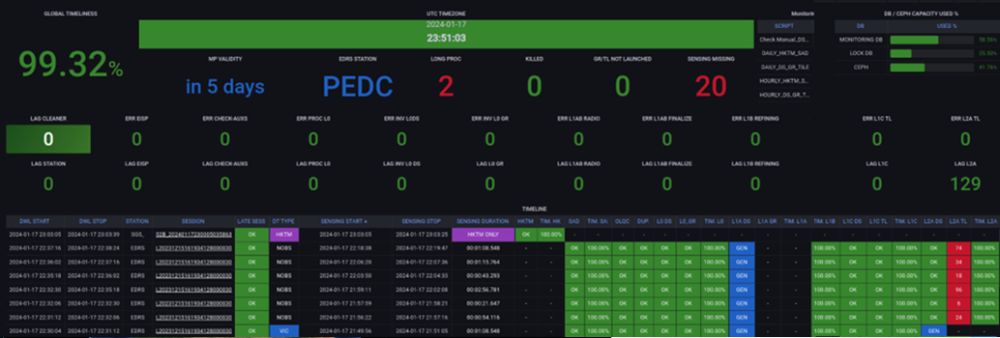

> __Customer__\: European Space Agency (ESA)

> __Programme__\: Copernicus

> __Supply Chain__\: ESA > CAP GEMINI IT. >  CS Group SPACE

# Context

The current suite of [Sentinel missions](https://www.esa.int/Applications/Observing_the_Earth/Copernicus/The_Sentinel_missions) are at the heart of the Copernicus programme, led by the European Commission. Each Sentinel mission is based on a constellation of two satellites to fulfil revisit and coverage requirements, providing robust datasets for Copernicus services. These missions carry a range of technologies, such as radar and multi-spectral imaging instruments for land, ocean and atmospheric monitoring.

The first Copernicus space component operations have been successfully in place since the launch of Sentinel-1A in 2014, with 7 satellites currently in routine operations. The initial approach to the design and implementation of land segment operations was designed in the early 2010s. To meet emerging user needs, additional [High Priority Candidate Missions (HPCM)](https://www.esa.int/Applications/Observing_the_Earth/Copernicus/Copernicus_Sentinel_Expansion_missions), also called Expansion Missions, are to be launched between 2026 and 2028, prior to the next generation of Sentinels planned for the 2030s. 

From 2019 to 2024, ESA is carrying out a redesign of the Copernicus ground system to bring about a rationalization of interfaces between services, standardization and simplification of interfaces, minimization of interdependencies between services. This overhaul will help meet the challenges of implementing new HPCM satellites: increased data volumes, industrial independence, deployment on public clouds, etc.
    
This redesign includes the following projects:

* __CSC Coordination Desk Service__: Ground Segment Operations Configuration Coordination, Anomalies and Maintenance coordination, Mission Planning Interface Data Delivery Point Operations
* __CSC Data Distribution Service__: Data Collection from PRIP interface, Data Access for en users, monitoring, reporting
* [__CSC Data Processors re-engineering__](project-esa-data-processors-reengineering-en.html): re-engineering the current operational Level-0, Level-1 and Level-2 processors, harmonisation of the processors interfaces, revision of the processor output data packaging and format, maximisation of the use of a modular approach, open-source
* [__CSC Reference System Service__](project-esa-reference-system-en.html): Open Source Implementation of the CSC Production and Distribution functions (the RS Software), sampling reference production environment for continuous CSC Production validation, environment to benchmark and validate new processors, environment to integrate and possibly operate new data flows, access to validated and qualified processors to GS operational services.
* [__CSC Production Services__](project-esa-production-sentinel-2-en.html): encompasses all activities necessary to convert any Sentinel data acquired on XBand and EDRS into user level data available on PRIP interface, meeting the quality specification and delivering it for user access and archiving.

CS Group responsabilities for ESA CSC Production Service Sentinel 2 are as follows:
* Turnkey supply of the optimised Sentinel-2B image processing system producing 160,000 files per day with strict timing constraints.
* Level 2 support and maintenance.

The features are as follows:
* Raw data ingestion (DDIP, EDIP); Aux data ingestion and selection
* Request Driven & Data Driven processing; Traceability; Products inventory; Baselines management
* Workflow management with 2 levels orchestration; Priority management; Horizontal Scaling capacities
* High performance big size local storage
* Logging; Failure recovery; Automatic alert notifications; Operation tooling
* Infrastructure agnostic; Open Source components
* Compliant with Copernicus security requirements

# Project implementation

The project objectives are as follows:
* Develop, integrate and maintain the Systematic Production Service for Sentinel-2 satellite in a high availability platform.
* 7/7 operations: thanks to our state-of-the-art operations tools, the operations team is able to detect, analyse and resolve any production problems within a very short timeframe.

The processes for carrying out the project are:
* Agile, Continuous integration

# Technical characteristics

The solution key points are as follows:
* The microservices architecture is based on a high-availability Kubernetes cloud cluster of around 100 virtual machines. 
* Non-linear workflow (SCDF)
* A message based (Kafka) choreography system with dynamic scaling
* A high-performance, finely optimised CEPH FS shared volume

The main technologies used in this project are:

{:class="table table-bordered table-dark"}
| Domain | Technology(ies) |
|--------|----------------|
|Hardware environment(s)|cloud and K8S|
|Operating System(s)|linux CentOS|
|Programming language(s)|java, python, scdf|
|Interoperability (protocols, format, APIs)|maven, docker file, k8s, helm, yaml|
|Production software (IDE, DEVOPS etc.)|VS Code, Eclipse|
|Main COTS library(ies)|k8s, Docker, ElasticSearch, Kafka, Grafana, Prometheus, Keda, CephFS, Spring Boot, SCDF|

{::comment}Abbreviations{:/comment}

*[CLI]: Command Line Interface
*[IaC]: Infrastructure as Code
*[PaaS]: Platform as a Service
*[VM]: Virtual Machine
*[OS]: Operating System
*[IAM]: Identity and Access Management
*[SIEM]: Security Information and Event Management
*[SSO]: Single Sign On
*[IDS]: intrusion detection
*[IPS]: intrusion prevention
*[NSM]: network security monitoring
*[DRMAA]: Distributed Resource Management Application API is a high-level Open Grid Forum API specification for the submission and control of jobs to a Distributed Resource Management (DRM) system, such as a Cluster or Grid computing infrastructure.
