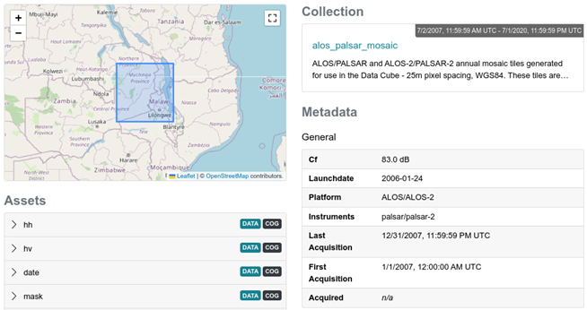
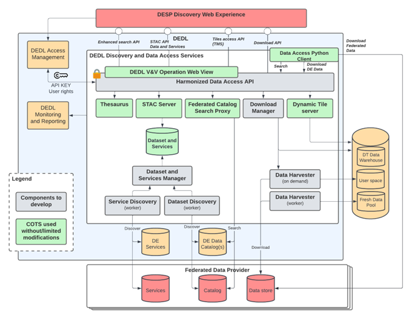

> __Customer__\: EUMETSAT (EUMETSAT)

> __Programme__\: DestinE

> __Supply Chain__\: EUMETSAT > CLOUDFERRO >  CS Group SPACE

# Context

CS Group responsabilities for DetinE Data Lake are as follows:
* Technical specifications
* Full implementation of Data Access Service Pool, Dataset and services Catalog, Discovery Services
* Integration
* Datasets configuration
* Operations

The features are as follows:
* Thesaurus
* Federated Catalog Search Proxy based on EODAG
* Download Manager
* Dynamic Tile Server
* Collections, Dataset and services Catalog provides schema, functions and a Python library for storing and accessing STAC collections and items
* Data Access Python Client helps to access and download Digital Twin data
* Web View allows graphical navigation in the DEDL catalogs, datasets and services

# Project implementation

The project objectives are as follows:
* Integration with DTEs
* Integration with DESP
* Harmonize Heterogeneous datasets and data sources access
* Interoperability with existing ecosystem
* Search effectiveness
* 24/7 availability
* Operation driven system

The processes for carrying out the project are:
* Continuous integration, Agile Development

# Technical characteristics

The solution key points are as follows:
* K8S micro-services, with 24/7 availability
* Harmonised access to heterogeneous data with EODAG
* High performance API for data access based on STAC and OGC standards
* Intelligent search based on Thesaurus
* Collection and items catalog with EOCatalog and visualisation with EOPortal

The main technologies used in this project are:

{:class="table table-bordered table-dark"}
| Domain | Technology(ies) |
|--------|----------------|
|Hardware environment(s)|PC x64|
|Operating System(s)|Linux Ubuntu|
|Programming language(s)|Python, GOLang|
|Interoperability (protocols, format, APIs)|REST, OPEN API 3, STAC|
|Production software (IDE, DEVOPS etc.)|Git, Gitlab, Docker, Pytest, Pydantic, Squash, RobotFramework, JMeter|
|Main COTS library(ies)|PgSTAC, STAC FastAPI, PySTAC, EODAG, Skosmos, POSTGRESQL, EOPortal, EOCatalog, Matomo, Jaeger|

{::comment}Abbreviations{:/comment}

*[CLI]: Command Line Interface
*[IaC]: Infrastructure as Code
*[PaaS]: Platform as a Service
*[VM]: Virtual Machine
*[OS]: Operating System
*[IAM]: Identity and Access Management
*[SIEM]: Security Information and Event Management
*[SSO]: Single Sign On
*[IDS]: intrusion detection
*[IPS]: intrusion prevention
*[NSM]: network security monitoring
*[DRMAA]: Distributed Resource Management Application API is a high-level Open Grid Forum API specification for the submission and control of jobs to a Distributed Resource Management (DRM) system, such as a Cluster or Grid computing infrastructure.
