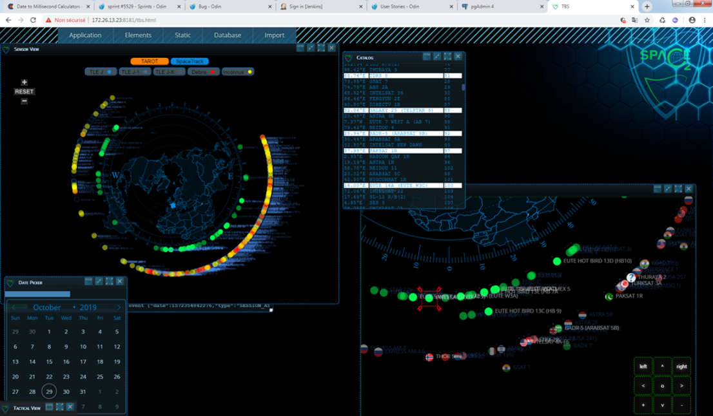
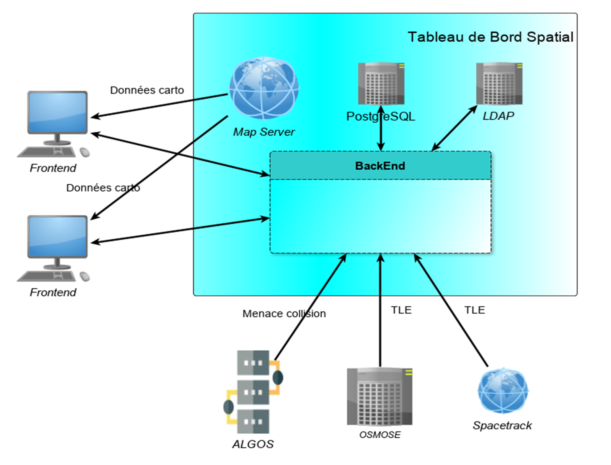

> __Customer__\: Centre National d'Etudes Spatiales - Commandement de l'Espace (CNES - CDE)

> __Programme__\: SSA

> __Supply Chain__\: CNES - CDE >  CS Group SPACE

# Context

CS Group responsabilities for Space Dashboard – Space Command are as follows:
* Development

The features are as follows:
* **Prototype of the first version of the TBS**:
* Proposal of a scalable architecture in accordance with the vision of a future spatial C2
* Focus on the main TBS screen (summary view), a page of GEO satellites, and a first set of cross-functional features (import, BD access, etc.) necessary or desirable for future versions
* Flexibility to integrate new and refined needs of the CDE (better visibility on developments and choices made)

# Project implementation

The project objectives are as follows:
* Realization for the CNES (main client) and for the Space Command (CDE) of an operational demonstrator of the TBS (Space Dashboard), which is the first SSA (Space Situational Awareness) brick of a future military space command and control (C2).

The processes for carrying out the project are:
* Agile - Fixed price project

# Technical characteristics

The solution key points are as follows:
* Web server (HTTPS and secure websocket, postgreSQL DB), Backend (Java, Jetty)
* Space mechanics libraries
* Service Access FrontEnds (TLE Spread)
* MapServer server (cartographic)
* Data connectors, Internet reception (TLE on SpaceTrack), calculated by CNES algorithms (OSMOSE: TLEs, Aphrodite: threats)

The main technologies used in this project are:

{:class="table table-bordered table-dark"}
| Domain | Technology(ies) |
|--------|----------------|
|Hardware environment(s)|PC|
|Operating System(s)|Linux, Windows|
|Programming language(s)|HTML, CSS, Typescript, ToPaZ, Java|
|Interoperability (protocols, format, APIs)|git, Tuleap|
|Main COTS library(ies)|OREKIT, PATRIUS, CESIUM Openlayers|

{::comment}Abbreviations{:/comment}

*[CLI]: Command Line Interface
*[IaC]: Infrastructure as Code
*[PaaS]: Platform as a Service
*[VM]: Virtual Machine
*[OS]: Operating System
*[IAM]: Identity and Access Management
*[SIEM]: Security Information and Event Management
*[SSO]: Single Sign On
*[IDS]: intrusion detection
*[IPS]: intrusion prevention
*[NSM]: network security monitoring
*[DRMAA]: Distributed Resource Management Application API is a high-level Open Grid Forum API specification for the submission and control of jobs to a Distributed Resource Management (DRM) system, such as a Cluster or Grid computing infrastructure.
