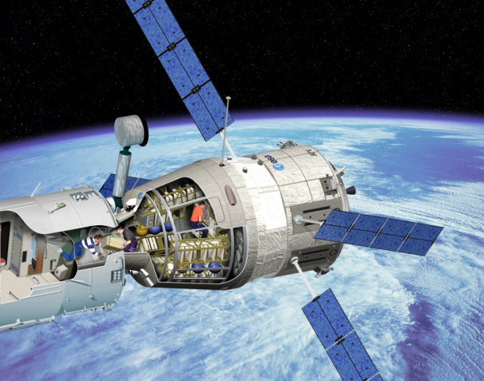

> __Customer__\: Centre National d'Etudes Spatiales (CNES)

> __Programme__\: ATV

> __Supply Chain__\: CNES >  CS Group SPACE

# Context

CS Group responsabilities for ATV Mission team support are as follows:
* Support for operations

The features are as follows:
* Training instructor: preparation of tests, creation of scenario, drafting of plans and follow -up, support for ESA for the preparation of simulations
* Interface with FDS teams
* Planner: preparation of the flight plan, verification of its consistency and transmission to the teams
* Operation Manager: real -time coordination of operations in accordance with the flight plan, management of operational contingencies; Interface with partners

# Project implementation

The project objectives are as follows:
* Support for operations within the ATV team
* Operational pre-qualification phases, operational qualification and ATV operations
* Support to the Mission team for the training roles Instructor, Planner, Operation Manager

The processes for carrying out the project are:
* Support Team

# Technical characteristics

The solution key points are as follows:
* Means of the ATV Control Center
* Mastery of the components of the ATV mission 
* Operational planning
* Continuation of the service 24 hours a day during the flight phases, team of 11 engineers (average)

The main technologies used in this project are:

{:class="table table-bordered table-dark"}
| Domain | Technology(ies) |
|--------|----------------|
|Hardware environment(s)|PC|
|Operating System(s)|Linux|
|Programming language(s)|KornShell, SCILAB|
|Production software (IDE, DEVOPS etc.)|cygwin, oscar, doors|

{::comment}Abbreviations{:/comment}

*[CLI]: Command Line Interface
*[IaC]: Infrastructure as Code
*[PaaS]: Platform as a Service
*[VM]: Virtual Machine
*[OS]: Operating System
*[IAM]: Identity and Access Management
*[SIEM]: Security Information and Event Management
*[SSO]: Single Sign On
*[IDS]: intrusion detection
*[IPS]: intrusion prevention
*[NSM]: network security monitoring
*[DRMAA]: Distributed Resource Management Application API is a high-level Open Grid Forum API specification for the submission and control of jobs to a Distributed Resource Management (DRM) system, such as a Cluster or Grid computing infrastructure.
