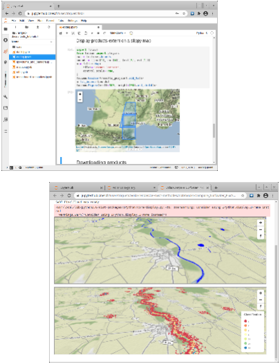
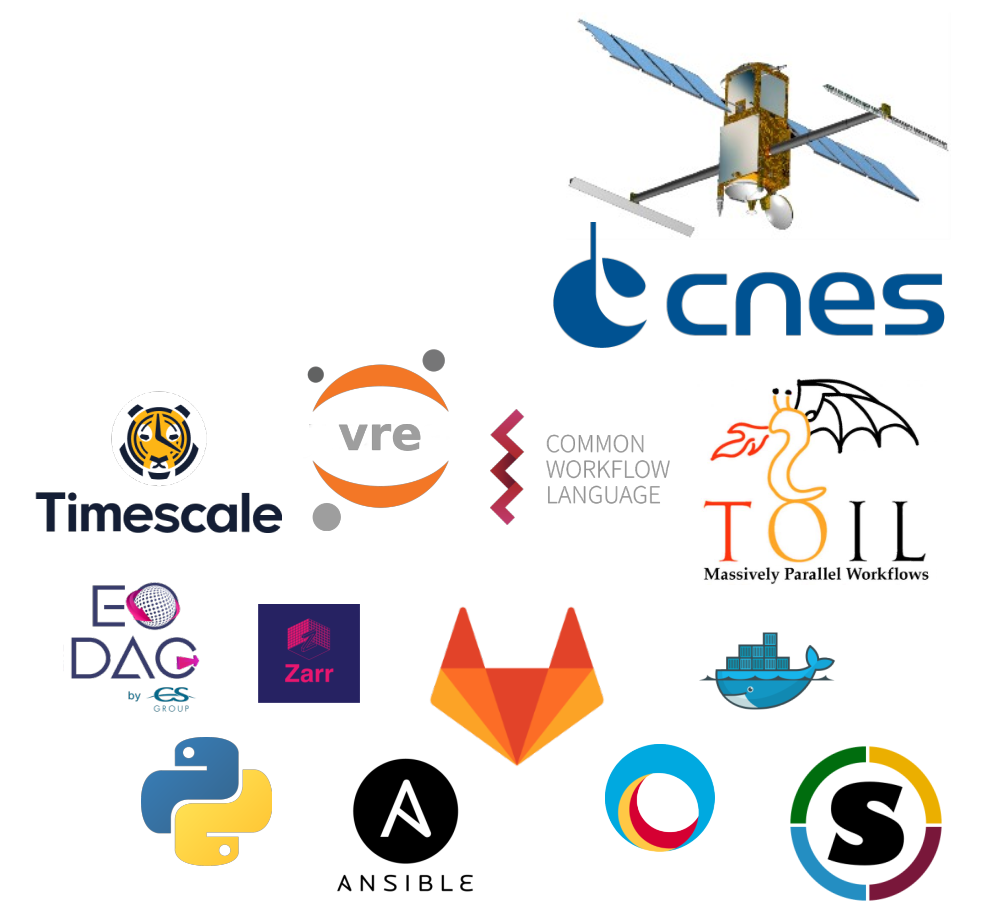

> __Customer__\: Centre National d’Études Spatiales (CNES)

> __Programme__\: SWOT

> __Supply Chain__\: CNES >  CS Group SPACE

# Context

CS Group responsabilities for SWOT Center of Expertise are as follows:
* Design, Development, Integration and Maintenance

The features are as follows:
* Integration of new processing versions.
* Replay of failed mission processings
* Calibration/Validation of algorithms

# Project implementation

The project objectives are as follows:
* Provision of a Calibration/Validation environment for SWOT algorithms
* Development and provision of interfacing tools for access to SWOT data
* Development and provision of replay and test tools for treatments
* CHRONOS SWOT processing orchestrator to facilitate the launch of on-demand processing

The processes for carrying out the project are:
* V cycle
* Development in iterations with regular presentations to end users
* Continuous development/integration platform at CNES accessible to end users

# Technical characteristics

The solution key points are as follows:
* CE-SWOT specific VRE extended from CNES core
* Access to multiple catalogs using OGC standard API STAC with component EODAG of VRE
* Provision of a Hydro repository and an Oceano repository (time series of SWOT products and ground truths)
* Orchestration and launch of processing identical to the SWOT mission with the CHRONOS orchestrator

The main technologies used in this project are:

{:class="table table-bordered table-dark"}
| Domain | Technology(ies) |
|--------|----------------|
|Hardware environment(s)|VMware, HPC5G CNES (Pbs)|
|Operating System(s)|GNU/Linux|
|Programming language(s)|Python|
|Interoperability (protocols, format, APIs)|S3, API REST, OGC STAC, JSON, Zarr, CWL|
|Production software (IDE, DEVOPS etc.)|Gitlab, Jenkins, SonarQube, Artifactory, Docker, Singularity, TimeScaleDB, Docker Compose/Swarm, Ansible, VRE (CNES), CHRONOS (CNES)|

{::comment}Abbreviations{:/comment}

*[CLI]: Command Line Interface
*[IaC]: Infrastructure as Code
*[PaaS]: Platform as a Service
*[VM]: Virtual Machine
*[OS]: Operating System
*[IAM]: Identity and Access Management
*[SIEM]: Security Information and Event Management
*[SSO]: Single Sign On
*[IDS]: intrusion detection
*[IPS]: intrusion prevention
*[NSM]: network security monitoring
*[DRMAA]: Distributed Resource Management Application API is a high-level Open Grid Forum API specification for the submission and control of jobs to a Distributed Resource Management (DRM) system, such as a Cluster or Grid computing infrastructure.
