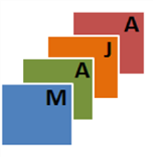

> __Customer__\: Centre National d'Etudes Spatiales (CNES)

> __Programme__\: Generic

> __Supply Chain__\: CNES >  CS Group SPACE

# Context

MAJA is a processing chain for atmospheric corrections and cloud detection. It produces L2A level images. Algorithms are developed by the CESBIO. It is a multi-sensor tool (S2, Pleiades, Landsat, SWH, Venus), open source, used in operation by the CNES production centers.
WASP allows generating cloud-free composite images for S2 and Venus. It typically works from MAJA outputs.
BIOPHY is a tool that allows the calculation of biophysical variables (NDVI, LAI, FAPAR, FCOVER, LAI_Cab) using a neural network developed by the INRAE.
OTB is an open source satellite image processing library offering a large number of high-performance applications, optical or radar, and used in the three processing chains MAJA, WASP and BIOPHY. OTB is developed by the CNES and has been the responsibility of CS GROUP for many years (see PLUTO_OTB project).

CS Group responsabilities for Maintenance of processing chains using the Orfeo Toolbox (OTB) -> MAJA, WASP & BIOPHY are as follows:
* Software Development
* Maintenance
* Support

The features are as follows:
* MAJA produces L2A with atmospheric corrections and cloud masks. Sensors S2, Pleiades, Landsat, SWH, Venus. Open source. 
* WASP produces cloud-free composite images from L2A. S2, Venus.
* BIOPHY outputs NDVI, LAI, FAPAR, FCOVER, LAI_Cab. S2, Landsat, Venus.
* OTB: open source multi-sensor satellite image processing library used in the 3 processing chains MAJA, WASP and BIOPHY. See PLUTO_OTB project.

# Project implementation

The project objectives are as follows:
* Maintenance (bugs and evol) 
* Support

The processes for carrying out the project are:
* Ticketing Workflow

# Technical characteristics

The solution key points are as follows:
* Gitlab

The main technologies used in this project are:

{:class="table table-bordered table-dark"}
| Domain | Technology(ies) |
|--------|----------------|
|Operating System(s)|Linux|
|Programming language(s)|Python, C++|
|Production software (IDE, DEVOPS etc.)|Git, Docker|

{::comment}Abbreviations{:/comment}

*[CLI]: Command Line Interface
*[IaC]: Infrastructure as Code
*[PaaS]: Platform as a Service
*[VM]: Virtual Machine
*[OS]: Operating System
*[IAM]: Identity and Access Management
*[SIEM]: Security Information and Event Management
*[SSO]: Single Sign On
*[IDS]: intrusion detection
*[IPS]: intrusion prevention
*[NSM]: network security monitoring
*[DRMAA]: Distributed Resource Management Application API is a high-level Open Grid Forum API specification for the submission and control of jobs to a Distributed Resource Management (DRM) system, such as a Cluster or Grid computing infrastructure.
