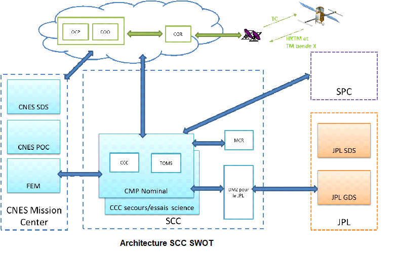
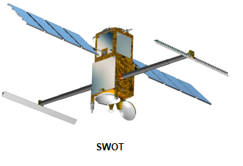

> __Customer__\: Centre National d'Etudes Spatiales (CNES)

> __Programme__\: SWOT

> __Supply Chain__\: CNES >  CS Group SPACE

# Context

CS Group responsabilities for CMP IVV, support in Technical and Operational Qualification and LEOP of SWOT mission are as follows:
* * Piloting of the IVV by CS GROUP, TQ/OQ tests by CNES

The features are as follows:
* **AIV**: development of procedures and LdP missionization, definition of strategy, plans and automated execution of tests (AIV tools for managing contexts, results, requirements)
	**QT/OQ System Tests**: preparation and support for the execution of compatibility/QT/OQ tests, development of ground operational procedures
	**Operations Support**: resources integrated into the CNES teams for launch, in-flight acceptance and start of life (shifts, ground on-call duties)

# Project implementation

The project objectives are as follows:
* Engineering assistance and support for carrying out the **integration and system qualification of the SWOT Satellite Installation and Maintenance Center** implementing the **ISIS Product Line**
* ISIS missionization and integration on science cluster

The processes for carrying out the project are:
* Requirements management (STB, IF): Testlink and Excel
* Specific process of Assembly, Integration, Validation Qualification of Ground Control Segments
* Ground control segment qualification system tests: Compatibility, Technical and Operational Qualification

# Technical characteristics

The solution key points are as follows:
* Configuration and deployment of CMPs: Nominal, Backup, SCP/SSV (experts) and test lines
* TM/TC ISIS chain operational qualification: BDS configurations, sessions, SLE, COP, catalogs, TM visualization, TC history
* Implementation of ISIS operational concepts: procedures, automation 
* Experienced AIV team for rapid skills development

The main technologies used in this project are:

{:class="table table-bordered table-dark"}
| Domain | Technology(ies) |
|--------|----------------|
|Hardware environment(s)|Esx Dell, SAN, Appliance Netbackup, HP Thin Pro, switch, firewall|
|Operating System(s)|Red Hat 7.5, VMWare, NoMachine,  PXE|
|Programming language(s)|Python, Bash|
|Interoperability (protocols, format, APIs)|XML, XTCE, Jason, CCSDS,  standard CNES XIF|
|Production software (IDE, DEVOPS etc.)|JIRA, Git, Ansible|
|Main COTS library(ies)|Ldap, IDM, ZeroMQ, SGBD|

{::comment}Abbreviations{:/comment}

*[CLI]: Command Line Interface
*[IaC]: Infrastructure as Code
*[PaaS]: Platform as a Service
*[VM]: Virtual Machine
*[OS]: Operating System
*[IAM]: Identity and Access Management
*[SIEM]: Security Information and Event Management
*[SSO]: Single Sign On
*[IDS]: intrusion detection
*[IPS]: intrusion prevention
*[NSM]: network security monitoring
*[DRMAA]: Distributed Resource Management Application API is a high-level Open Grid Forum API specification for the submission and control of jobs to a Distributed Resource Management (DRM) system, such as a Cluster or Grid computing infrastructure.
