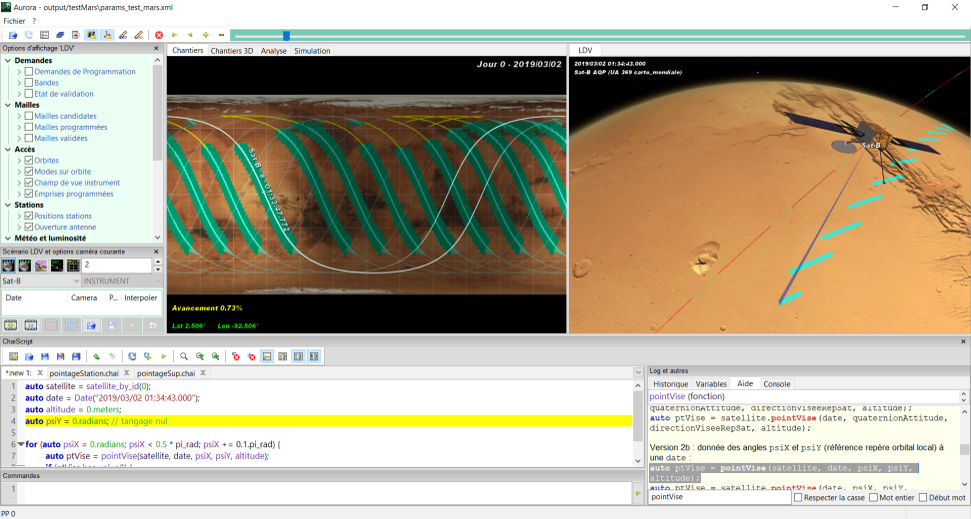
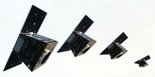

> __Customer__\: Centre National d'Etudes Spatiales (CNES)

> __Programme__\: CO3D

> __Supply Chain__\: CNES >  CS Group SPACE

# Context

CS Group responsabilities for CO3D Mission Simulator are as follows:
* Development

The features are as follows:
* Mission Programming Simulator
* Comparison of mission performance for different satellite or mission designs
* Long-term progress analysis of on-going projects (including bi-satellite stereo mapping of all the emerged lands),
* Comparison of mission performance regarding scheduled acquisitions properties
* Dimensioning needs evaluation (reservations of station passages, satellite memory, etc.).

# Project implementation

The project objectives are as follows:
* Realization of configurable and fast tools to simulate the mission programming of the land cover over a long term horizon in order to validate the industrial choices on the definition of the satellites and the constellation, and to study various programming alternatives ; 
* CO3D mission programming support

The processes for carrying out the project are:
* V Cycle

# Technical characteristics

The solution key points are as follows:
* Provide the client with efficient tools for analyzing programming alternatives over long horizons
* Provide an ability to understand mission issues
* Experience in Earth observation mission programming
* Development of mission simulators optimized in terms of calculation time.
* Responsiveness to customer needs.

The main technologies used in this project are:

{:class="table table-bordered table-dark"}
| Domain | Technology(ies) |
|--------|----------------|
|Hardware environment(s)|PC|
|Operating System(s)|Windows, Linux|
|Programming language(s)|Java|
|Interoperability (protocols, format, APIs)|XML|
|Production software (IDE, DEVOPS etc.)|Eclipse, Testlink, git|
|Main COTS library(ies)|POLARIS|

{::comment}Abbreviations{:/comment}

*[CLI]: Command Line Interface
*[IaC]: Infrastructure as Code
*[PaaS]: Platform as a Service
*[VM]: Virtual Machine
*[OS]: Operating System
*[IAM]: Identity and Access Management
*[SIEM]: Security Information and Event Management
*[SSO]: Single Sign On
*[IDS]: intrusion detection
*[IPS]: intrusion prevention
*[NSM]: network security monitoring
*[DRMAA]: Distributed Resource Management Application API is a high-level Open Grid Forum API specification for the submission and control of jobs to a Distributed Resource Management (DRM) system, such as a Cluster or Grid computing infrastructure.
