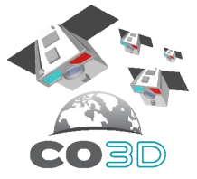

> __Customer__\: Centre National d'Etudes Spatiales (CNES)

> __Programme__\: CO3D

> __Supply Chain__\: CNES >  CS Group SPACE

# Context

CS Group responsabilities for 3D Optical Constellation CO3D Image Processing are as follows:
* Design, Development, Integration and Maintenance,

The features are as follows:
* Implementation of an operational processing chain in micro-services, orchestrated in the cloud via Zeebe.
* 2D and 3D production (stereo 3D reconstruction)
* CODIP deployed in several operational centers, in particular on the cloud.

# Project implementation

The project objectives are as follows:
* Development for the CO3D constellation of the CODIP image processing chain: CO3D Image Processing
* Combined application of the agile Scrum method and the DevOps approach

The processes for carrying out the project are:
* Agile Scrum method
* Continuous Cloud Deployment

# Technical characteristics

The solution key points are as follows:
* Algorithmic blocks of the chain cut into dockerized micro-services
*     Service layer in Python
*     Binding C++ for algo processing binaries
* Data exchange via S3 storage
* Service orchestration with Zeebe
* Strong scalability via cloud deployment

The main technologies used in this project are:

{:class="table table-bordered table-dark"}
| Domain | Technology(ies) |
|--------|----------------|
|Hardware environment(s)|Cloud (Flexible Engine)|
|Operating System(s)|GNU/Linux|
|Programming language(s)|GO, Python, C++|
|Interoperability (protocols, format, APIs)|S3, API REST, JSON|
|Production software (IDE, DEVOPS etc.)|Gitlab, Jenkins, SonarQube, Artifactory, Docker, Kubernetes, Zeebe, HashiCorp Vault, Vaultwarden|
|Main COTS library(ies)|CARS, GDAL, Taskflow, ALCIDE, MARIO, PESTO, boto3, pytest, ASTRIDZ, LIBGEO, DISIMUL, cookiecutter, pandas, pygdal, laspy, taskflow, boto3, testfixtures, jsonschema, numpy, rasterio, black, isort, pre-commit, pylint, pytest, clang, cython, cmake, scikit-image, scikit-learn, sphinx, wheel, proj, libgeotiff|

{::comment}Abbreviations{:/comment}

*[CLI]: Command Line Interface
*[IaC]: Infrastructure as Code
*[PaaS]: Platform as a Service
*[VM]: Virtual Machine
*[OS]: Operating System
*[IAM]: Identity and Access Management
*[SIEM]: Security Information and Event Management
*[SSO]: Single Sign On
*[IDS]: intrusion detection
*[IPS]: intrusion prevention
*[NSM]: network security monitoring
*[DRMAA]: Distributed Resource Management Application API is a high-level Open Grid Forum API specification for the submission and control of jobs to a Distributed Resource Management (DRM) system, such as a Cluster or Grid computing infrastructure.
