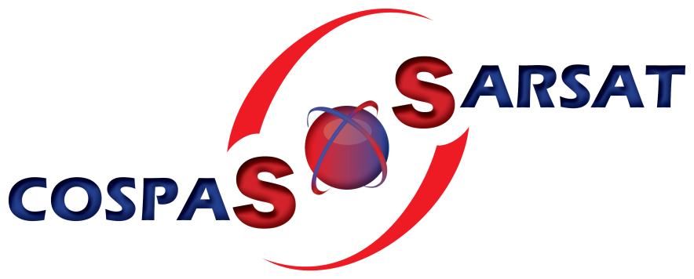

> __Customer__\: Centre National d'Etudes Spatiales (CNES)

> __Programme__\: COSPAS SARSAT

> __Supply Chain__\: CNES >  CS Group SPACE

# Context

CS Group responsabilities for COSPAS-SARSAT Operations are as follows:
* Operations support

The features are as follows:
* Preparation and execution of commissioning tests, pre-IOC performances monitoring, and support to the definition of the SAR/Galileo services document & activation of laboratory equipment
* Preparation of SAR/Galileo operations (at system level) 
* Configuration control of the whole SAR/Galileo Ground Segment Coverage (SGS), and inventory of the system components
* Preparation and validation of maintenance and operational procedures, configuration and commissioning of means, first level maintenance on the Hosting Entity means

# Project implementation

The project objectives are as follows:
* Preparation and execution of COSPAS-SARSAT system operations

The processes for carrying out the project are:
* V Cycle

# Technical characteristics

The solution key points are as follows:
* Ground Segment Qualification

The main technologies used in this project are:

{:class="table table-bordered table-dark"}
| Domain | Technology(ies) |
|--------|----------------|
|Operating System(s)|Linux|

{::comment}Abbreviations{:/comment}

*[CLI]: Command Line Interface
*[IaC]: Infrastructure as Code
*[PaaS]: Platform as a Service
*[VM]: Virtual Machine
*[OS]: Operating System
*[IAM]: Identity and Access Management
*[SIEM]: Security Information and Event Management
*[SSO]: Single Sign On
*[IDS]: intrusion detection
*[IPS]: intrusion prevention
*[NSM]: network security monitoring
*[DRMAA]: Distributed Resource Management Application API is a high-level Open Grid Forum API specification for the submission and control of jobs to a Distributed Resource Management (DRM) system, such as a Cluster or Grid computing infrastructure.
