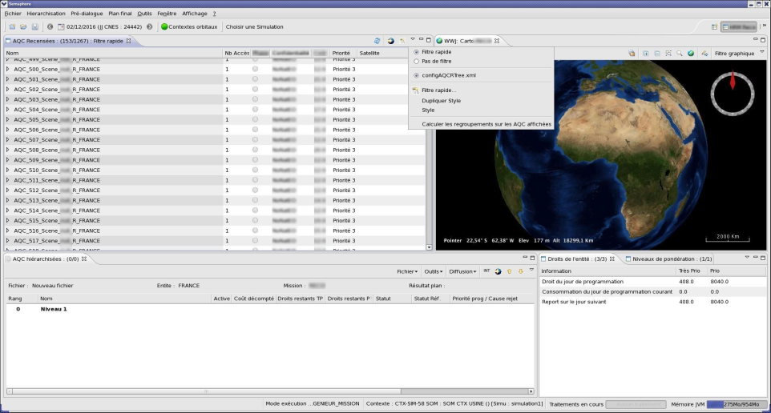
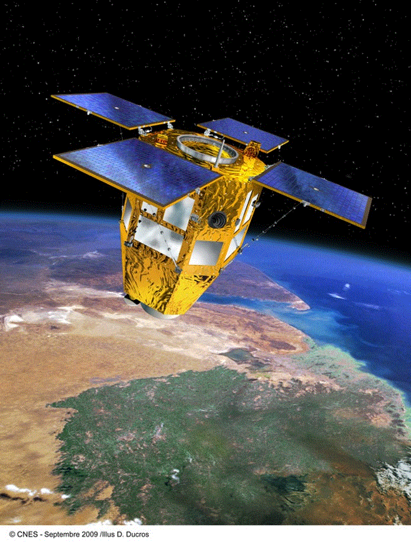

> __Customer__\: Centre National d'Etudes Spatiales (CNES)

> __Programme__\: CSO

> __Supply Chain__\: CNES >  CS Group SPACE

# Context

CS Group responsabilities for CSO Mission Simulator are as follows:
* Design, Development, Validation

The features are as follows:
* Design of the CSO mission simulator, based on the ALIS infrastructure
* Development and validation of successive versions.
* Integration of new functionalities (mission API, HMI, etc.)
* Regular integration of new versions of GOTLIB/PHRLIB
* Reversal of functionalities developed for the CSO Simulator in ALIS

# Project implementation

The project objectives are as follows:
* Develop a mission simulator based on the ALIS generic simulation infrastructure.

The processes for carrying out the project are:
* V Cycle

# Technical characteristics

The solution key points are as follows:
* Instance of CNES generic mission simulator platform ALIS
* Mathematical tools,
* ALIS low-level services or business features (mission planning, management of the user requests, etc.),
* LibMission,  GOTLIB/PHRLIB librairies

The main technologies used in this project are:

{:class="table table-bordered table-dark"}
| Domain | Technology(ies) |
|--------|----------------|
|Hardware environment(s)|PC|
|Operating System(s)|Linux 64-bits, Windows XP/Windows 7|
|Programming language(s)|Java, C, C++|
|Interoperability (protocols, format, APIs)|XML|
|Production software (IDE, DEVOPS etc.)|Eclipse RCP, Testlink, SVN, GForge|
|Main COTS library(ies)|World Wind Java, OpenGL, RMI, XStream, Hibernate, HSQLDB, JNA, VTS (CNES), PrestoPlot (CNES), PHRLIB, GOTLIB|

{::comment}Abbreviations{:/comment}

*[CLI]: Command Line Interface
*[IaC]: Infrastructure as Code
*[PaaS]: Platform as a Service
*[VM]: Virtual Machine
*[OS]: Operating System
*[IAM]: Identity and Access Management
*[SIEM]: Security Information and Event Management
*[SSO]: Single Sign On
*[IDS]: intrusion detection
*[IPS]: intrusion prevention
*[NSM]: network security monitoring
*[DRMAA]: Distributed Resource Management Application API is a high-level Open Grid Forum API specification for the submission and control of jobs to a Distributed Resource Management (DRM) system, such as a Cluster or Grid computing infrastructure.
