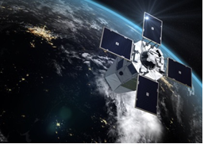

> __Customer__\: Centre National d'Etudes Spatiales (CNES)

> __Programme__\: CSO

> __Supply Chain__\: CNES >  CS Group SPACE

# Context

CS Group responsabilities for CSO Programming Chain are as follows:
* Design, Development, Integration, Maintenance 
* Detailed analysis of specifications
* Design driven by ecore models
* 100% critical code coverage
* Cross validation of critical algorithms
* User support and IV support

The features are as follows:
* MPLIB (Mission Preparation LIBrary) : programming data preparation
* CPM (Mission Programming Component) : international mission plans generation from candidate acquisitions and programming and payload tracking management
* OURSON (OUtil de Recensement et de Saisie des Opérations techNologiques) Image Quality OT management via a cartographic GUI
* CPMLIB, QILIB (CNES algorithm functions) : algorithmic processings.

# Project implementation

The project objectives are as follows:
* Development of CSO Programming chain

The processes for carrying out the project are:
* Continuous integration (coding/unit testing)

# Technical characteristics

The solution key points are as follows:
* consortium with Capgemini, Spacebel, Astrium

The main technologies used in this project are:

{:class="table table-bordered table-dark"}
| Domain | Technology(ies) |
|--------|----------------|
|Hardware environment(s)|DELL|
|Operating System(s)|RedHat 6.x|
|Programming language(s)|C++, java, python, ecore|
|Production software (IDE, DEVOPS etc.)|Eclipse|
|Main COTS library(ies)|apache, tomcat, log4|

{::comment}Abbreviations{:/comment}

*[CLI]: Command Line Interface
*[IaC]: Infrastructure as Code
*[PaaS]: Platform as a Service
*[VM]: Virtual Machine
*[OS]: Operating System
*[IAM]: Identity and Access Management
*[SIEM]: Security Information and Event Management
*[SSO]: Single Sign On
*[IDS]: intrusion detection
*[IPS]: intrusion prevention
*[NSM]: network security monitoring
*[DRMAA]: Distributed Resource Management Application API is a high-level Open Grid Forum API specification for the submission and control of jobs to a Distributed Resource Management (DRM) system, such as a Cluster or Grid computing infrastructure.
