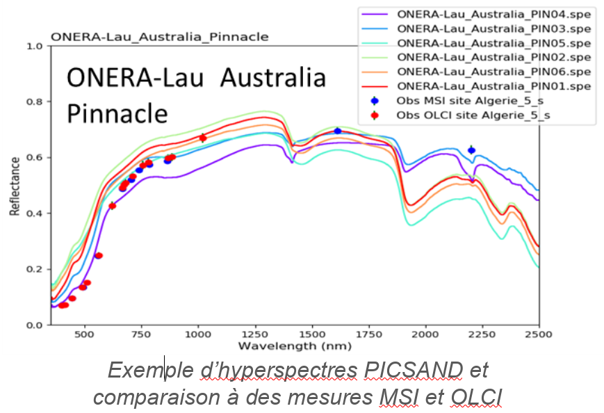

> __Customer__\: Centre National d'Etudes Spatiales (CNES)

> __Programme__\: DTQTIS

> __Supply Chain__\: CNES >  CS Group SPACE

# Context

CS Group responsabilities for Absolute radiometric calibration - Studies for improving Sade -Muscle tools are as follows:
* Study, development

The features are as follows:
* **Improvement hyperspectral interpolation on deserted sites :**
* Analysis of available hyperspectres (Gome-2, Onera, Ecostress, Picsand)
* Generation of reference hyperspectres for desert sites 
* Application to calibration (MSI, OLCI, SLSTR)
	**Toa spectral integration for deserted calibration :**
* Adaptation of muscle/implementation of algorithm
* BOA/TOA integration comparison (Spot-6 and SLSTR calibrations)
	**Rayleigh/glitter calibration :**
* Development BRDF Morel & Gentili Correction (Integration Muscle-Neo in progress)
* Study on improving the spectral interpolation of air conditioning reflectances

# Project implementation

The project objectives are as follows:
* Improve the modeling of surface reflectance of desert calibration sites 
* Replace the spline interpolation made from multi-spectral measures with an interpolation from a hyperspectrans
* Replace the integration of surface reflectance by integration of the simulated signal at the top of the atmosphere

The processes for carrying out the project are:
* Study, tests, regular advancement meetings

# Technical characteristics

The solution key points are as follows:
* Incommensurate

The main technologies used in this project are:

{:class="table table-bordered table-dark"}
| Domain | Technology(ies) |
|--------|----------------|
|Programming language(s)|IDL, Python|
|Production software (IDE, DEVOPS etc.)|SADE/MUSCLE|

{::comment}Abbreviations{:/comment}

*[CLI]: Command Line Interface
*[IaC]: Infrastructure as Code
*[PaaS]: Platform as a Service
*[VM]: Virtual Machine
*[OS]: Operating System
*[IAM]: Identity and Access Management
*[SIEM]: Security Information and Event Management
*[SSO]: Single Sign On
*[IDS]: intrusion detection
*[IPS]: intrusion prevention
*[NSM]: network security monitoring
*[DRMAA]: Distributed Resource Management Application API is a high-level Open Grid Forum API specification for the submission and control of jobs to a Distributed Resource Management (DRM) system, such as a Cluster or Grid computing infrastructure.
