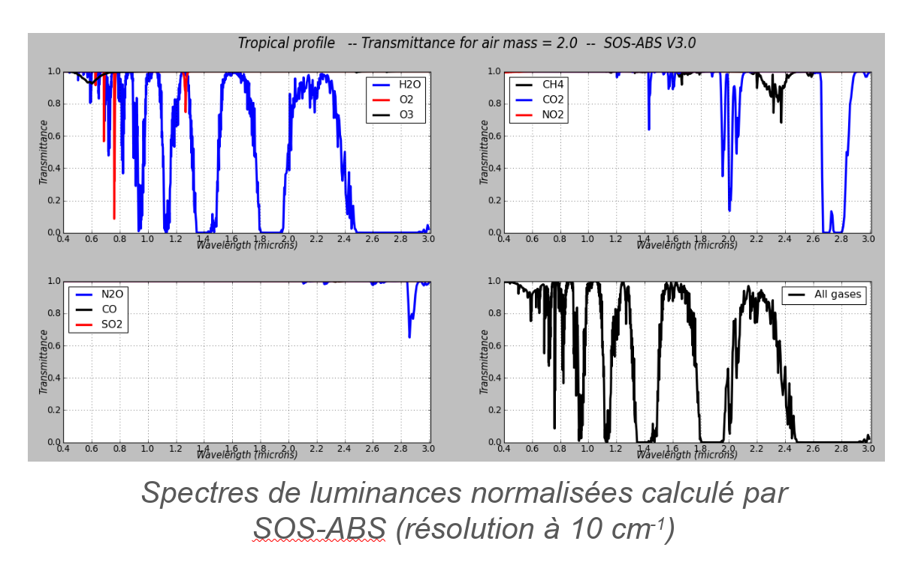

> __Customer__\: Centre National d'Etudes Spatiales (CNES)

> __Programme__\: DTQTIS

> __Supply Chain__\: CNES >  CS Group SPACE

# Context

CS Group responsabilities for Radiative transfer codes improvement study are as follows:
* Method specification, development, validation, user support

The features are as follows:
* **SOS-ABS :**
*     Gaseous absorption management: Introduction of the CKD method, optimization of the atmospheric profile 
*     Introduction of the Maignan BPDF model
*     Definition of the aerosol model by multi-modes mixture
*     Simplification of use: Warning Word Erroned key, possibility of simultaneous treatments
	**Osoaa :**
*     User advice
*     Training during "Ocean Optics XXV"
	**Support for the integration of SOS-ABS in 4A/OP**
	**Introduction training for radiative transfer**

# Project implementation

The project objectives are as follows:
* Evolutionary maintenance of SOS-ABS and OSOAA codes

The processes for carrying out the project are:
* Study, tests, taking user feedback into account

# Technical characteristics

The solution key points are as follows:
* Order line (for SOS-ABS and OSOAA) or Binding Python (for SOS-ABS)
* IHM for OSOAA

The main technologies used in this project are:

{:class="table table-bordered table-dark"}
| Domain | Technology(ies) |
|--------|----------------|
|Operating System(s)|Linux|
|Programming language(s)|Fortran, Java|
|Production software (IDE, DEVOPS etc.)|SOS-ABS, OSOAA|

{::comment}Abbreviations{:/comment}

*[CLI]: Command Line Interface
*[IaC]: Infrastructure as Code
*[PaaS]: Platform as a Service
*[VM]: Virtual Machine
*[OS]: Operating System
*[IAM]: Identity and Access Management
*[SIEM]: Security Information and Event Management
*[SSO]: Single Sign On
*[IDS]: intrusion detection
*[IPS]: intrusion prevention
*[NSM]: network security monitoring
*[DRMAA]: Distributed Resource Management Application API is a high-level Open Grid Forum API specification for the submission and control of jobs to a Distributed Resource Management (DRM) system, such as a Cluster or Grid computing infrastructure.
