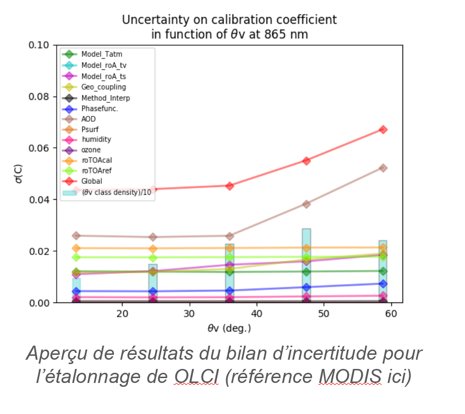

> __Customer__\: Centre National d'Etudes Spatiales (CNES)

> __Programme__\: DTQTIS

> __Supply Chain__\: CNES >  CS Group SPACE

# Context

CS Group responsabilities for Uncertainties of the deserted calibration for the sensors Sentinel3 are as follows:
* Study, development

The features are as follows:
* Adaptation of an existing tool (R&T CNES) to the Sentinel3 case
* Analysis of the existing (Code & A.T.B.D.) => Proposal for improvements and corrections 
* Development / testing of improvements
* Quantification of the typical uncertainties provided at the input of the code (BRDF, interpolation, radiative transfer, radiometry)
* Application to the calibration of OLCI and SLSTR sensors 
* Extension for use with Sentinel2 (to be finalized)

# Project implementation

The project objectives are as follows:
* Identify and quantify the different sources of uncertainty of the deserted calibration method. Application to S3.

The processes for carrying out the project are:
* Bibliography, code analysis / improvements, development, validation, actual data application, reports

# Technical characteristics

The solution key points are as follows:
* Incommensurate

The main technologies used in this project are:

{:class="table table-bordered table-dark"}
| Domain | Technology(ies) |
|--------|----------------|
|Programming language(s)|Python, IDL, KSH|
|Main COTS library(ies)|MUSCLE, SOS-ABS, SMAC|

{::comment}Abbreviations{:/comment}

*[CLI]: Command Line Interface
*[IaC]: Infrastructure as Code
*[PaaS]: Platform as a Service
*[VM]: Virtual Machine
*[OS]: Operating System
*[IAM]: Identity and Access Management
*[SIEM]: Security Information and Event Management
*[SSO]: Single Sign On
*[IDS]: intrusion detection
*[IPS]: intrusion prevention
*[NSM]: network security monitoring
*[DRMAA]: Distributed Resource Management Application API is a high-level Open Grid Forum API specification for the submission and control of jobs to a Distributed Resource Management (DRM) system, such as a Cluster or Grid computing infrastructure.
