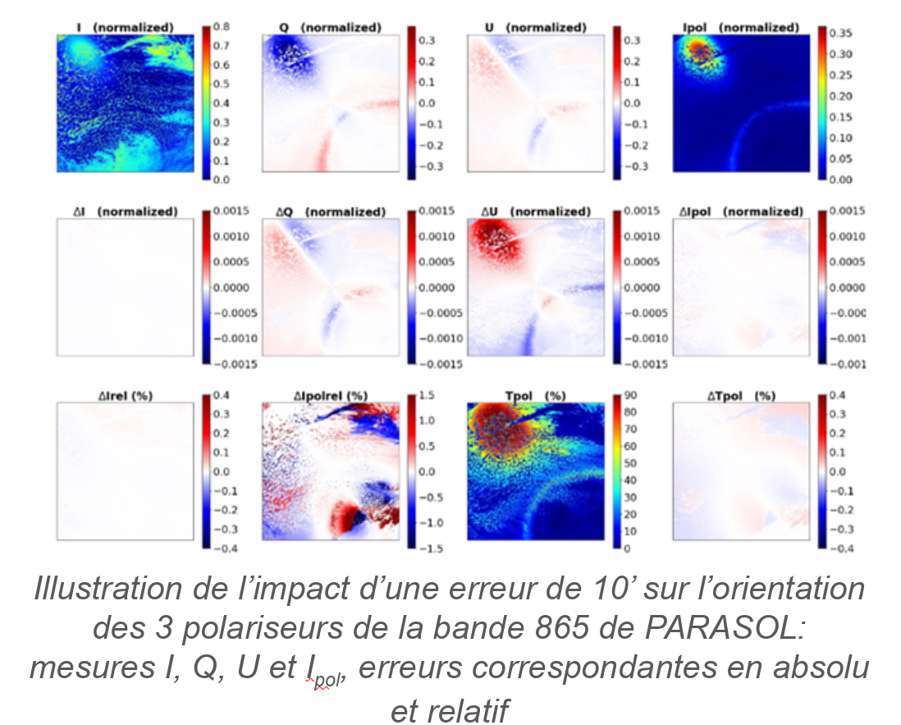

> __Customer__\: Centre National d'Etudes Spatiales (CNES)

> __Programme__\: DTQTIS

> __Supply Chain__\: CNES >  CS Group SPACE

# Context

CS Group responsabilities for Absolute radiometric calibration - Performance assessment 3MI are as follows:
* Study, development

The features are as follows:
* **Development of a simulator applying a calibration error to parasol measures and making a statistical analysis of the impact on radiometry.**
	**Application to sensitivity estimates :**
*     - Uncertainties on the orientation of polarizers
*     - ignorance of the extinction rate of polarizers 
*     - Error on the relative transmission between channels of a triplet of polarizers
*     - HF equalization noise and radiometric noise
*     - Non-linearity error

# Project implementation

The project objectives are as follows:
* Analyze 3MI's performance with regard to specifications

The processes for carrying out the project are:
* Study, regular meetings

# Technical characteristics

The solution key points are as follows:
* Reference simulated images
* Inversion module of level L1 to measurement
* Instrumental radiometric model modification module
* Module of passage of measurements to data L1
* Images generated with calibration error
* Module for analyzing the differences between images

The main technologies used in this project are:

{:class="table table-bordered table-dark"}
| Domain | Technology(ies) |
|--------|----------------|
|Operating System(s)|Cluster Linux HAL|
|Programming language(s)|Python|

{::comment}Abbreviations{:/comment}

*[CLI]: Command Line Interface
*[IaC]: Infrastructure as Code
*[PaaS]: Platform as a Service
*[VM]: Virtual Machine
*[OS]: Operating System
*[IAM]: Identity and Access Management
*[SIEM]: Security Information and Event Management
*[SSO]: Single Sign On
*[IDS]: intrusion detection
*[IPS]: intrusion prevention
*[NSM]: network security monitoring
*[DRMAA]: Distributed Resource Management Application API is a high-level Open Grid Forum API specification for the submission and control of jobs to a Distributed Resource Management (DRM) system, such as a Cluster or Grid computing infrastructure.
