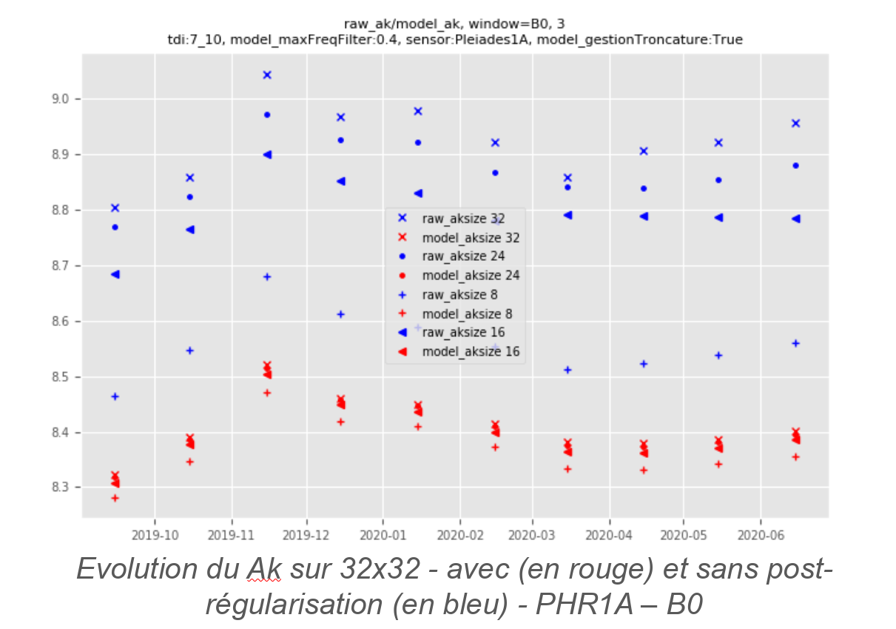

> __Customer__\: Centre National d'Etudes Spatiales (CNES)

> __Programme__\: DTQTIS

> __Supply Chain__\: CNES >  CS Group SPACE

# Context

CS Group responsabilities for Studies for absolute calibration and FTM measurement of Pleiades sensors (Star & Moon methods) are as follows:
* Study, treatments, development

The features are as follows:
* **Phr1a & phr1b stalking stalks:**
* Generation of starpools using the ICC Isatis procedure
* Addition of new Starpools to previously used data
* Analysis of new input data: trace of time series of the digital account of each star for Starpools Pléiades 1A and 1B and for different sizes of extraction windows
* Estimation of absolute calibration coefficients and FTM
	**Pneo3 & pneo4 moon stalker:**
* Realization of pre-working and calibration treatments for pneo3 & pneo4
* Evolution of calibration and synthesis tools to refine the analysis of the results

# Project implementation

The project objectives are as follows:
* Estimate of absolute calibration and FTM for Pléiades 1A and 1b (Star method)
* Calculation & analysis of pneo3 & pneo4 absolute calibration coefficients (moon method)

The processes for carrying out the project are:
* Study, regular advancement meetings

# Technical characteristics

The solution key points are as follows:
* Incommensurate

The main technologies used in this project are:

{:class="table table-bordered table-dark"}
| Domain | Technology(ies) |
|--------|----------------|
|Programming language(s)|Python|
|Production software (IDE, DEVOPS etc.)|ICC Pléiades|

{::comment}Abbreviations{:/comment}

*[CLI]: Command Line Interface
*[IaC]: Infrastructure as Code
*[PaaS]: Platform as a Service
*[VM]: Virtual Machine
*[OS]: Operating System
*[IAM]: Identity and Access Management
*[SIEM]: Security Information and Event Management
*[SSO]: Single Sign On
*[IDS]: intrusion detection
*[IPS]: intrusion prevention
*[NSM]: network security monitoring
*[DRMAA]: Distributed Resource Management Application API is a high-level Open Grid Forum API specification for the submission and control of jobs to a Distributed Resource Management (DRM) system, such as a Cluster or Grid computing infrastructure.
