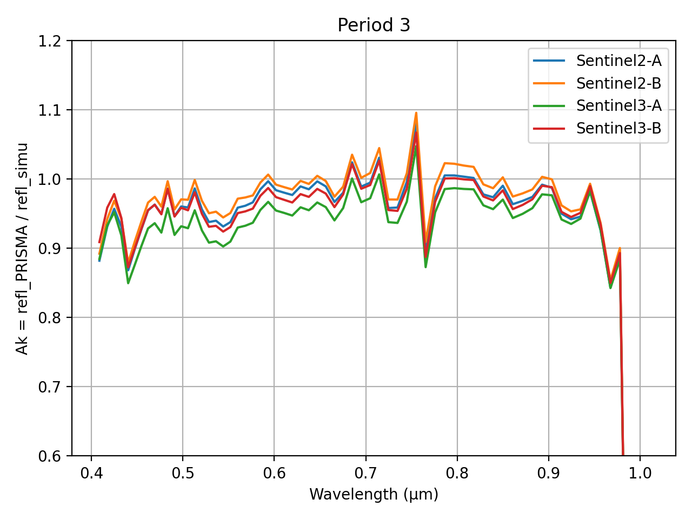

> __Customer__\: Centre National d'Etudes Spatiales (CNES)

> __Programme__\: DTQTIS

> __Supply Chain__\: CNES >  CS Group SPACE

# Context

CS Group responsabilities for Calibration study of the hyperspectral sensor prisma are as follows:
* Study, development

The features are as follows:
* Comparison of interpolation methods (cubic spline vs hyperspectral method) 
* Analysis of the influence of the reference sensor (Sentinel-2 vs Sentinel-3) on the calibration results 
* Analysis of the influence of the AOT (default value, modis, CAMS)
* Analysis of the influence of aerosol models
* Comparison with muscle (multispectral, cubic spline)
* Analysis of different campaigns

# Project implementation

The project objectives are as follows:
* Adapt the inter-stretchy method to desert sites, applicable to multi-mind sensors, to a hyperspectral sensor 
* Test the tool on prisma data

The processes for carrying out the project are:
* Study, tests, regular progress points

# Technical characteristics

The solution key points are as follows:
* Incommensurate

The main technologies used in this project are:

{:class="table table-bordered table-dark"}
| Domain | Technology(ies) |
|--------|----------------|
|Programming language(s)|Python, ksh|
|Production software (IDE, DEVOPS etc.)|MUSCLE|

{::comment}Abbreviations{:/comment}

*[CLI]: Command Line Interface
*[IaC]: Infrastructure as Code
*[PaaS]: Platform as a Service
*[VM]: Virtual Machine
*[OS]: Operating System
*[IAM]: Identity and Access Management
*[SIEM]: Security Information and Event Management
*[SSO]: Single Sign On
*[IDS]: intrusion detection
*[IPS]: intrusion prevention
*[NSM]: network security monitoring
*[DRMAA]: Distributed Resource Management Application API is a high-level Open Grid Forum API specification for the submission and control of jobs to a Distributed Resource Management (DRM) system, such as a Cluster or Grid computing infrastructure.
