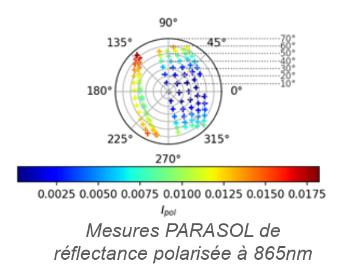
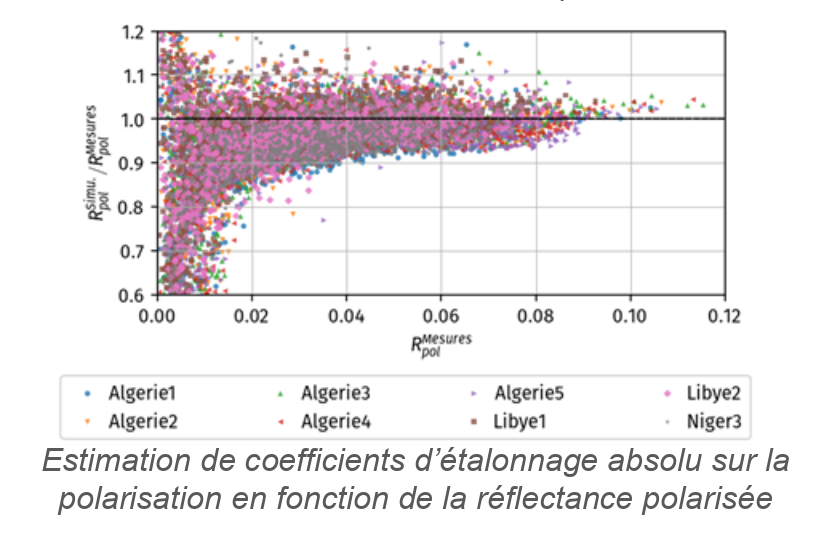

> __Customer__\: Centre National d'Etudes Spatiales (CNES)

> __Programme__\: DTQTIS

> __Supply Chain__\: CNES >  CS Group SPACE

# Context

CS Group responsabilities for Polarization calibration on natural sites are as follows:
* Study

The features are as follows:
* **Polarized signal sensitivity analysis :**
*     Estimation of the diffusion orders contributing to the polarized signal at the TOA
*     Influence of the aerosol model
*     Influence of surface properties (BRDF, refractive index)
*     Influence of sight geometry and AOT
*     Parametric analysis
	**Representativeness of BPDF models on desert sites :**
*     Comparison of measurements and modeling for different BPDF models
*     Analysis of the results of inversion of the weighting coefficient of the Maignan model

# Project implementation

The project objectives are as follows:
* Characterize the surface polarization of desert sites (BPDF) with a view to carrying out an absolute calibration on the polarized bands (3MI mission)

The processes for carrying out the project are:
* Studies, Simulations, Progress Meetings, Report

# Technical characteristics

The solution key points are as follows:
* Not applicable

The main technologies used in this project are:

{:class="table table-bordered table-dark"}
| Domain | Technology(ies) |
|--------|----------------|
|Programming language(s)|IDL, KSH|
|Main COTS library(ies)|SOS-ABS, MUSCLE|

{::comment}Abbreviations{:/comment}

*[CLI]: Command Line Interface
*[IaC]: Infrastructure as Code
*[PaaS]: Platform as a Service
*[VM]: Virtual Machine
*[OS]: Operating System
*[IAM]: Identity and Access Management
*[SIEM]: Security Information and Event Management
*[SSO]: Single Sign On
*[IDS]: intrusion detection
*[IPS]: intrusion prevention
*[NSM]: network security monitoring
*[DRMAA]: Distributed Resource Management Application API is a high-level Open Grid Forum API specification for the submission and control of jobs to a Distributed Resource Management (DRM) system, such as a Cluster or Grid computing infrastructure.
