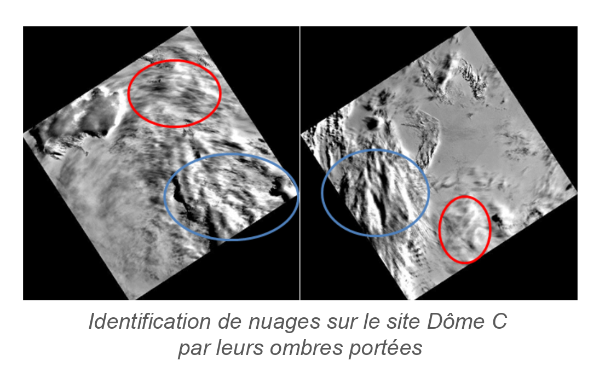

> __Customer__\: Centre National d'Etudes Spatiales (CNES)

> __Programme__\: DTQTIS

> __Supply Chain__\: CNES >  CS Group SPACE

# Context

CS Group responsabilities for Studies for the calibration of Sentinel-2 / MSI are as follows:
* Study, development

The features are as follows:
* Calibration on desert sites and update of the half-yearly report for ESA
* Assessment of Deserts uncertainties (In progress)
* Implementation of calibration on Antarctic sites, with study of the impact of clouds on the calibration results
* Realization and analysis of S2A and S2B calibrations on Antarctic sites
* Study for the identification of new areas for calibration on Clouds
* Development of an extraction prototype for new Clouds sites

# Project implementation

The project objectives are as follows:
* Bring a support to the calibration of MSI sensors aboard Sentinel-2a and 2B

The processes for carrying out the project are:
* Study, regular advancement meetings

# Technical characteristics

The solution key points are as follows:
* Incommensurate

The main technologies used in this project are:

{:class="table table-bordered table-dark"}
| Domain | Technology(ies) |
|--------|----------------|
|Programming language(s)|IDL, Python|
|Production software (IDE, DEVOPS etc.)|SADE/MUSCLE|

{::comment}Abbreviations{:/comment}

*[CLI]: Command Line Interface
*[IaC]: Infrastructure as Code
*[PaaS]: Platform as a Service
*[VM]: Virtual Machine
*[OS]: Operating System
*[IAM]: Identity and Access Management
*[SIEM]: Security Information and Event Management
*[SSO]: Single Sign On
*[IDS]: intrusion detection
*[IPS]: intrusion prevention
*[NSM]: network security monitoring
*[DRMAA]: Distributed Resource Management Application API is a high-level Open Grid Forum API specification for the submission and control of jobs to a Distributed Resource Management (DRM) system, such as a Cluster or Grid computing infrastructure.
