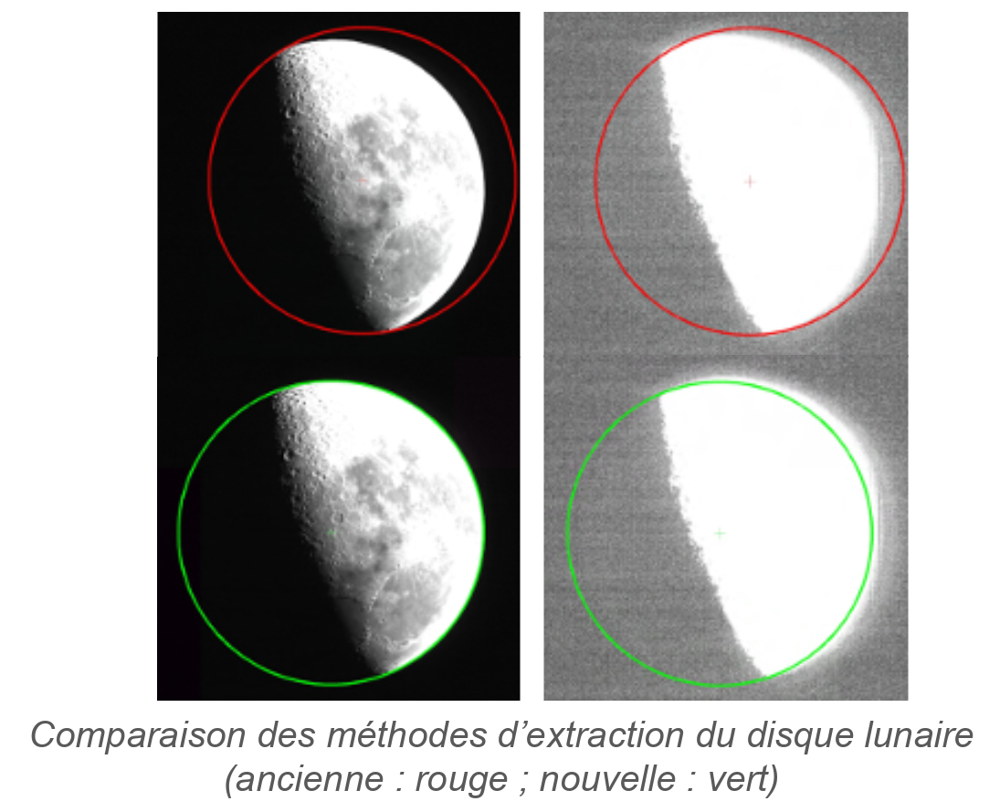

> __Customer__\: Centre National d'Etudes Spatiales (CNES)

> __Programme__\: Venμs

> __Supply Chain__\: CNES >  CS Group SPACE

# Context

CS Group responsabilities for Studies for the calibration of Venus are as follows:
* Study, development, recipe support in flight

The features are as follows:
* Improvement of the lunar disk extraction method (Laplace filter)
* Quantification of residual noise of type CT1 and CT2
* Analysis of the temporal drift after updating of official parameters (PO) 
* Gain in computing time by reprunction band to band
* New pixel filtering method
* Improvement of the statistical results file
* Comparison to calibrations of the desert method
* Analysis of the moon calibration results and deserts of a new phase corresponding to an altitude change

# Project implementation

The project objectives are as follows:
* Improve calibrations by the Moon's aim
* Script (SNO method) for its integration into the operational chain (SAG)
* Use of the moon calibration script for flight recipe after change of orbit

The processes for carrying out the project are:
* Study, regular advancement points

# Technical characteristics

The solution key points are as follows:
* Incommensurate

The main technologies used in this project are:

{:class="table table-bordered table-dark"}
| Domain | Technology(ies) |
|--------|----------------|
|Programming language(s)|Python, IDL|

{::comment}Abbreviations{:/comment}

*[CLI]: Command Line Interface
*[IaC]: Infrastructure as Code
*[PaaS]: Platform as a Service
*[VM]: Virtual Machine
*[OS]: Operating System
*[IAM]: Identity and Access Management
*[SIEM]: Security Information and Event Management
*[SSO]: Single Sign On
*[IDS]: intrusion detection
*[IPS]: intrusion prevention
*[NSM]: network security monitoring
*[DRMAA]: Distributed Resource Management Application API is a high-level Open Grid Forum API specification for the submission and control of jobs to a Distributed Resource Management (DRM) system, such as a Cluster or Grid computing infrastructure.
