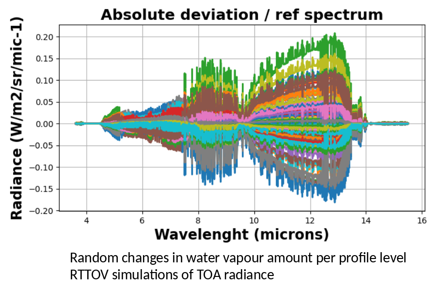

> __Customer__\: Centre National d'Etudes Spatiales (CNES)

> __Programme__\: TRISHNA

> __Supply Chain__\: CNES >  CS Group SPACE

# Context

CS Group responsabilities for Flight calibration of TRISHNA on instrumented sites are as follows:
* Study, development

The features are as follows:
* Simulation of uncertainty on a large number of atmospheric profiles (water vapor, ozone, temperature)
* Simulation of luminance at TOA using the RTTOV code from 4 to 12 microns
* Analysis of the impact on the observable luminance of the uncertainties on the profiles
* Application to the TRISHNA sensor

# Project implementation

The project objectives are as follows:
* Study the feasibility of an absolute calibration on an instrumented site for a spatial sensor in thermal infrared

The processes for carrying out the project are:
* Study, regular meetings

# Technical characteristics

The solution key points are as follows:
* Processing model

The main technologies used in this project are:

{:class="table table-bordered table-dark"}
| Domain | Technology(ies) |
|--------|----------------|
|Operating System(s)|Cluster Linux HAL|
|Programming language(s)|Python|

{::comment}Abbreviations{:/comment}

*[CLI]: Command Line Interface
*[IaC]: Infrastructure as Code
*[PaaS]: Platform as a Service
*[VM]: Virtual Machine
*[OS]: Operating System
*[IAM]: Identity and Access Management
*[SIEM]: Security Information and Event Management
*[SSO]: Single Sign On
*[IDS]: intrusion detection
*[IPS]: intrusion prevention
*[NSM]: network security monitoring
*[DRMAA]: Distributed Resource Management Application API is a high-level Open Grid Forum API specification for the submission and control of jobs to a Distributed Resource Management (DRM) system, such as a Cluster or Grid computing infrastructure.
