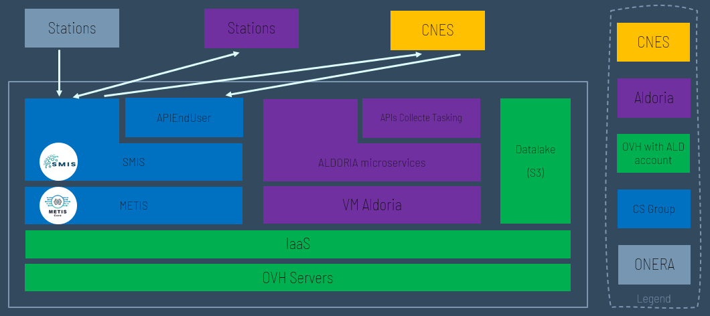

> __Customer__\: FRANCE 2030

> __Programme__\: France 2030

> __Supply Chain__\: FRANCE 2030 > CNES >  CS Group SPACE

# Context

CS Group responsabilities for Evolution de la Surveillance Spatiale Optique et Radar are as follows:
* Platform Design, Development, Integration, Maintenance.

The features are as follows:
* Collecting SSA optical and radar data,
* Catalogue SSA data,
* Distribute SSA data,
* Handle on-demand observations.

# Project implementation

The project objectives are as follows:
* Demonstration of an SSA data provision service to significantly increase the security of space operations.

The processes for carrying out the project are:
* V-model

# Technical characteristics

The solution key points are as follows:
* Platform based on METIS and SMIS

The main technologies used in this project are:

{:class="table table-bordered table-dark"}
| Domain | Technology(ies) |
|--------|----------------|
|Hardware environment(s)|Cloud|
|Operating System(s)|Linux|
|Programming language(s)|Python|
|Main COTS library(ies)|SMIS, METIS, ToPaZ|

{::comment}Abbreviations{:/comment}

*[CLI]: Command Line Interface
*[IaC]: Infrastructure as Code
*[PaaS]: Platform as a Service
*[VM]: Virtual Machine
*[OS]: Operating System
*[IAM]: Identity and Access Management
*[SIEM]: Security Information and Event Management
*[SSO]: Single Sign On
*[IDS]: intrusion detection
*[IPS]: intrusion prevention
*[NSM]: network security monitoring
*[DRMAA]: Distributed Resource Management Application API is a high-level Open Grid Forum API specification for the submission and control of jobs to a Distributed Resource Management (DRM) system, such as a Cluster or Grid computing infrastructure.
