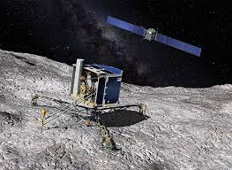
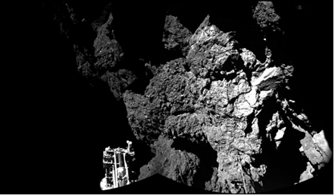

> __Customer__\: Centre National d'Etudes Spatiales (CNES)

> __Programme__\: Interplanetary

> __Supply Chain__\: CNES >  CS Group SPACE

# Context

CS Group responsabilities for FDS PHILAE & OPERATIONS are as follows:
* Development, validation, support

The features are as follows:
* Development of the Flight Dynamics software for Philae
* Participation in landing site selection operations
* Participation in separation descent landing operations, first scientific sequence and preparation of a possible long-term scientific sequence
* Carrying out various mission analyses necessary for the selection of the landing site
* Participation in activities related to the Philae wake-up
* Support to the Philae scientific community during the mission

# Project implementation

The project objectives are as follows:
* Develop and validate the flight dynamics system and support the flight dynamics team

The processes for carrying out the project are:
* Technical Assistance

# Technical characteristics

The solution key points are as follows:
* Understanding of customer needs
* Skills in space mechanics
* Knowledge of operations
* Full understanding of the SDS tool and procedure
* Ability to manage a tight schedule
* Knowledge of Rosetta mission and comets environment

The main technologies used in this project are:

{:class="table table-bordered table-dark"}
| Domain | Technology(ies) |
|--------|----------------|
|Hardware environment(s)|PC/SUN station|
|Operating System(s)|Linux/unix/windows|
|Programming language(s)|Fortran, shell, scilab|
|Production software (IDE, DEVOPS etc.)|SVN, VTS, celestlab|

{::comment}Abbreviations{:/comment}

*[CLI]: Command Line Interface
*[IaC]: Infrastructure as Code
*[PaaS]: Platform as a Service
*[VM]: Virtual Machine
*[OS]: Operating System
*[IAM]: Identity and Access Management
*[SIEM]: Security Information and Event Management
*[SSO]: Single Sign On
*[IDS]: intrusion detection
*[IPS]: intrusion prevention
*[NSM]: network security monitoring
*[DRMAA]: Distributed Resource Management Application API is a high-level Open Grid Forum API specification for the submission and control of jobs to a Distributed Resource Management (DRM) system, such as a Cluster or Grid computing infrastructure.
