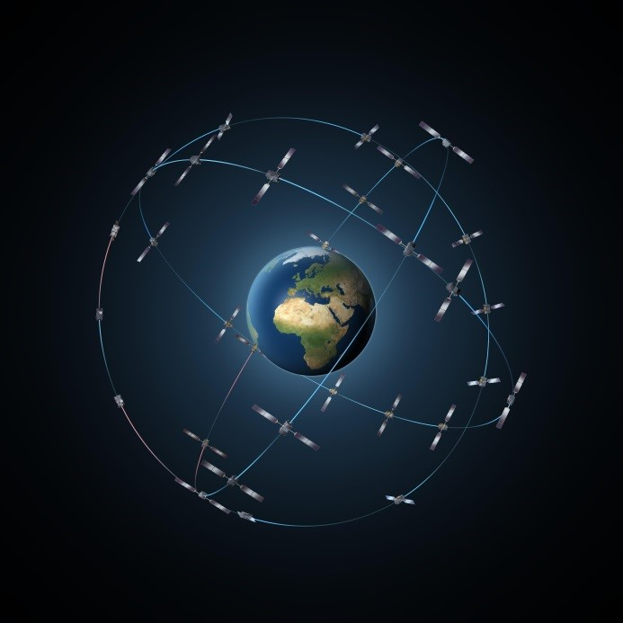

> __Customer__\: Centre National d'Etudes Spatiales (CNES)

> __Programme__\: Galileo

> __Supply Chain__\: CNES >  CS Group SPACE

# Context

CNES is in charge of LEOP GALILEO satellites for IOV1 and IOV2 (In Orbit validation) phases.
ESOC (MOIS, SCOS2000) 
Duration: 2010-2011

CS Group responsabilities for GALILEO Ground Segment Operation Support are as follows:
* Ground assets preparation, Operations Support

The features are as follows:
* **OPF and MOIS tools** for the management of user requests/writing associated changing requests
	**Development of Tools** for integrating the operational data in the technical environment and producing relevant validation data for board-ground teams and for the SVT and IOV phases
	**Integration of CSIM scripts** written by the operation teams in the corresponding tool

# Project implementation

The project objectives are as follows:
* Preparation and participation to System Validation Tests (SVT) 
* Support for the preparation of ground assets (different tools) and the monitoring of LEOP operations

The processes for carrying out the project are:
* Support

# Technical characteristics

The solution key points are as follows:
* ESOC technical environment (MOIS, SCOS2000, ...)
* Complex planning and project

The main technologies used in this project are:

{:class="table table-bordered table-dark"}
| Domain | Technology(ies) |
|--------|----------------|
|Operating System(s)|Linux|
|Programming language(s)|Shell|
|Interoperability (protocols, format, APIs)|TCP/IP|
|Main COTS library(ies)|SCOS2000, MOIS|

{::comment}Abbreviations{:/comment}

*[CLI]: Command Line Interface
*[IaC]: Infrastructure as Code
*[PaaS]: Platform as a Service
*[VM]: Virtual Machine
*[OS]: Operating System
*[IAM]: Identity and Access Management
*[SIEM]: Security Information and Event Management
*[SSO]: Single Sign On
*[IDS]: intrusion detection
*[IPS]: intrusion prevention
*[NSM]: network security monitoring
*[DRMAA]: Distributed Resource Management Application API is a high-level Open Grid Forum API specification for the submission and control of jobs to a Distributed Resource Management (DRM) system, such as a Cluster or Grid computing infrastructure.
