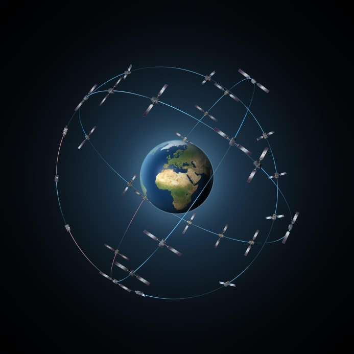

> __Customer__\: Centre National d'Etudes Spatiales (CNES)

> __Programme__\: Galileo

> __Supply Chain__\: CNES >  CS Group SPACE

# Context

CNES is in charge of LEOP GALILEO satellites for IOV (In Orbit validation) and FOC (Full Operational Capability) phases.
Industrial organization: CS GROUP with ALTRAN as subcontractor
Satellites: ADS and OHB
Also RAO in 2015 for the WP6 and GSOP phases
Environment: ESOC (MOIS, SCOS2000)

CS Group responsabilities for GALILEO On-board Operation Support are as follows:
* Ground assets preparation, support for LEOP operations of the constellation's satellites

The features are as follows:
* SOE Position (Spacecraft Operations Engineer) for DHS, TTC and AOCS subsystems
* Training on ESOC and CNES ground segment
* Production and validation of Flight Operations and associated files (monitoring, displays, mimics, …)
* Support for following up the on-board team
* Participation to the simulation exercices (SVT, QO and LEOP)
* Participation in project reviews
* Participation in LEOP

# Project implementation

The project objectives are as follows:
* Support to the CNES OP sub-directorate for the preparation and monitoring of LEOP operations for the satellites of the Galileo constellation

The processes for carrying out the project are:
* Support

# Technical characteristics

The solution key points are as follows:
* European context: CNES / ESOC / Astrium / OHB
* GALILEO platforms and ESOC and CNES ground facilities; On-board DHS, AOCS, TTC subsystems of IOV and FOC platforms
* Operations carried out alternately from ESOC (Darmstadt) or on the CNES site (Toulouse)
* Teams integrated into 24/7 shifts over the duration of LEOP operations
* Project management with subcontracting

The main technologies used in this project are:

{:class="table table-bordered table-dark"}
| Domain | Technology(ies) |
|--------|----------------|
|Operating System(s)|Linux|
|Programming language(s)|Shell|
|Interoperability (protocols, format, APIs)|TCP/IP|
|Main COTS library(ies)|SCOS2000, MOIS|

{::comment}Abbreviations{:/comment}

*[CLI]: Command Line Interface
*[IaC]: Infrastructure as Code
*[PaaS]: Platform as a Service
*[VM]: Virtual Machine
*[OS]: Operating System
*[IAM]: Identity and Access Management
*[SIEM]: Security Information and Event Management
*[SSO]: Single Sign On
*[IDS]: intrusion detection
*[IPS]: intrusion prevention
*[NSM]: network security monitoring
*[DRMAA]: Distributed Resource Management Application API is a high-level Open Grid Forum API specification for the submission and control of jobs to a Distributed Resource Management (DRM) system, such as a Cluster or Grid computing infrastructure.
