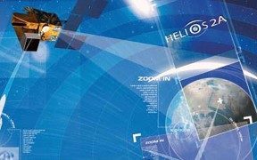

> __Customer__\: Centre National d'Etudes Spatiales (CNES)

> __Programme__\: Spot Helios

> __Supply Chain__\: CNES >  CS Group SPACE

# Context

CS Group responsabilities for Support for ground operations of the Maintenance Center at Post Helios 2A / 2B are as follows:
* Strengthen CNES teams, maintain CMPs in operational conditions, respect operational constraints

The features are as follows:
* **Operation of CMP**, namely :
* 24-hour SOL on-call: operational monitoring of conf. hardware and software
* Monitoring of installations, guarantee of software integrity
* Participation in operational meetings 
* Test support for the Bord, Mission and Orbito teams
	**Technical management of subsystems** (STS, DUTCH, CGCU, EGM, OMGS, FOS/ARPE, CCS, etc.), namely :
* Monitoring of software vis-à-vis the industrial resp. maintenance 
* Validation of new versions
* On-call support for software problems
* Preparation for CNES software monitoring commissions

# Project implementation

The project objectives are as follows:
* Ensure operations for the SOL operating service of the Station Maintenance Centers of HELIOS satellites by delegation of tasks
* MCO (Maintenance in operational conditions) of the ground means used to ensure the operations of the HELIOS sector satellites

The processes for carrying out the project are:
* V Cycle

# Technical characteristics

The solution key points are as follows:
* Maintaining skills to ensure MCO and support for operations over a very long period

The main technologies used in this project are:

{:class="table table-bordered table-dark"}
| Domain | Technology(ies) |
|--------|----------------|
|Hardware environment(s)|HP-UX, PC|
|Operating System(s)|Linux RedHat, Windows|
|Interoperability (protocols, format, APIs)|BPD,  FTP, VMWare|
|Production software (IDE, DEVOPS etc.)|Testlink|
|Main COTS library(ies)|CRYSPIS, NetBackup|

{::comment}Abbreviations{:/comment}

*[CLI]: Command Line Interface
*[IaC]: Infrastructure as Code
*[PaaS]: Platform as a Service
*[VM]: Virtual Machine
*[OS]: Operating System
*[IAM]: Identity and Access Management
*[SIEM]: Security Information and Event Management
*[SSO]: Single Sign On
*[IDS]: intrusion detection
*[IPS]: intrusion prevention
*[NSM]: network security monitoring
*[DRMAA]: Distributed Resource Management Application API is a high-level Open Grid Forum API specification for the submission and control of jobs to a Distributed Resource Management (DRM) system, such as a Cluster or Grid computing infrastructure.
