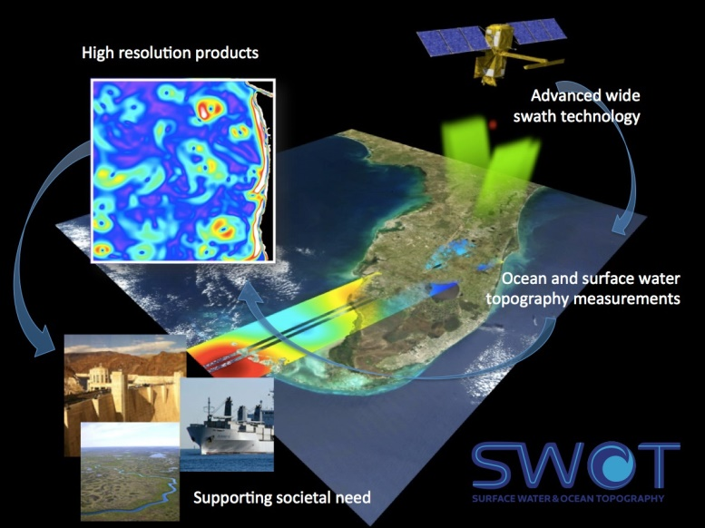
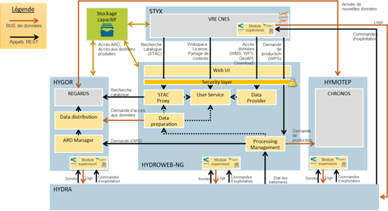

> __Customer__\: Centre National d’Études Spatiales (CNES)

> __Programme__\: SWOT aval

> __Supply Chain__\: CNES >  CS Group SPACE

# Context

CS Group responsabilities for Development of a centralized portal for hydrological data are as follows:
* Design, development and deployment on CNES and Cloud means.
* Guarantee and maintenance.
* Support and training for users, community animation.

The features are as follows:
* **HYGOR**: Mana**G**ement and **OR**organization of data
	**HYDROWEB-NG**: Dissemination of data
	**HYMOTEP**: Production of data
	**STYX** (**S**cience **T**estbedand h**Y**sopeII data e**X**ploration): Scientific exploration
	**HYDRA** (**D**etection, **R**eport and **A**nalysis): Hypervision of the system

# Project implementation

The project objectives are as follows:
* A system for centralization, provision and processing of hydrological data, to better understand the water cycle
* For scientific, institutional, private or educational accesses
* Brings together all useful data (spatial, in situ, model, etc.)
* Single French access to SWOT HR data, a major revolution in the quantity of hydrological measurements

The processes for carrying out the project are:
* The HYSOPEII system is developed in **Agile/DevOps** mode and uses the **UXDesign** method to collect user needs.

# Technical characteristics

The solution key points are as follows:
* **Reuse** of CNES components: REGARDS (cataloging); CHRONOS (orchestrator); VRE (scientific exploration)
* Free standards and components
	**Portability and scalability**: Stateless microservices; Docker and Singularity; Kubernetes; Ansible and Helm; Portable on CNES and CLOUD infrastructure
* User-centered design

The main technologies used in this project are:

{:class="table table-bordered table-dark"}
| Domain | Technology(ies) |
|--------|----------------|
|Hardware environment(s)|Cluster HPC du CNES, Docker/Singularity, Docker SWARM/Kubernetes|
|Operating System(s)|Tous OS Serveur (par containerisation), tous OS Client (interfaces web sans plugins)|
|Programming language(s)|Java, Python, Helm|
|Interoperability (protocols, format, APIs)|OGC API, STAC API, OCI, AMQP, Docker, CWL, REST, POSIX, S3|
|Production software (IDE, DEVOPS etc.)|Jupyter, JupyterHub, Ansible, EODAG, …|

{::comment}Abbreviations{:/comment}

*[CLI]: Command Line Interface
*[IaC]: Infrastructure as Code
*[PaaS]: Platform as a Service
*[VM]: Virtual Machine
*[OS]: Operating System
*[IAM]: Identity and Access Management
*[SIEM]: Security Information and Event Management
*[SSO]: Single Sign On
*[IDS]: intrusion detection
*[IPS]: intrusion prevention
*[NSM]: network security monitoring
*[DRMAA]: Distributed Resource Management Application API is a high-level Open Grid Forum API specification for the submission and control of jobs to a Distributed Resource Management (DRM) system, such as a Cluster or Grid computing infrastructure.
