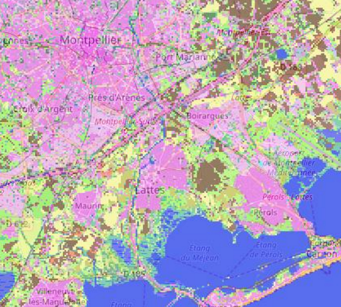

> __Customer__\: Centre National d'Etudes Spatiales (CNES)

> __Programme__\: Generic

> __Supply Chain__\: CNES >  CS Group SPACE

# Context

IOTA² is a land-use map production line for large areas based on time series of Sentinel or Landsat images developped for CNES / CESBIO. In order to facilitate methodological contributions, IOTA² is open-source. As such, the channel makes extensive use of the image processing applications provided by Orfeo ToolBox.

CS Group responsabilities for IOTA² - Infrastructure for Land Use by Automatic Treatment are as follows:
* Maintenance and evolution of the IOTA² chain in order to meet the needs of land use map production
* User support

The features are as follows:
* Use of sensors of different types (optical/radar) to obtain better quality classifications
* Users can provide exogenous data as well as primitive data
* Possibility of spatially delineating learning zones
* Automatic calculation of primitives allowing the help to determine the label
* Merging classifications
* Automatic generation of coefficients allowing the evaluation of the quality of the classification
* Division into stages of the chain allows it to be launched only on very specific stages

# Project implementation

The project objectives are as follows:
* IOTA² - land-use map production line for large areas based on time series of Sentinel or Landsat images
* Annual production of a national land use map
* Testing new algorithms over large areas

The processes for carrying out the project are:
* Software V-Model

# Technical characteristics

The solution key points are as follows:
* Automatic installation with its dependencies
* Combined use of Orfeo ToolBox multi-threading and MPI speeds up calculations
* Understanding of different N2A product formats (THEIA + PEPS) to be able to classify as many geographical areas as possible

The main technologies used in this project are:

{:class="table table-bordered table-dark"}
| Domain | Technology(ies) |
|--------|----------------|
|Operating System(s)|Unix, Linux Ubuntu, CentOS|
|Programming language(s)|Python, C++|
|Production software (IDE, DEVOPS etc.)|GCC 4.8|
|Main COTS library(ies)|OTB, GDAL, Qgis|

{::comment}Abbreviations{:/comment}

*[CLI]: Command Line Interface
*[IaC]: Infrastructure as Code
*[PaaS]: Platform as a Service
*[VM]: Virtual Machine
*[OS]: Operating System
*[IAM]: Identity and Access Management
*[SIEM]: Security Information and Event Management
*[SSO]: Single Sign On
*[IDS]: intrusion detection
*[IPS]: intrusion prevention
*[NSM]: network security monitoring
*[DRMAA]: Distributed Resource Management Application API is a high-level Open Grid Forum API specification for the submission and control of jobs to a Distributed Resource Management (DRM) system, such as a Cluster or Grid computing infrastructure.
