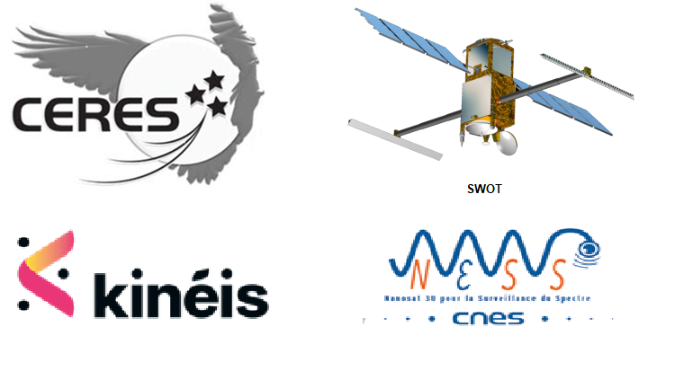

> __Customer__\: Centre National d'Etudes Spatiales (CNES)

> __Programme__\: Multi-missions

> __Supply Chain__\: CNES >  CS Group SPACE

# Context

CS Group responsabilities for Assistance to ISIS project management of the Ceres, Swot, Merlin, N3SS and Kineis missions are as follows:
* * Support managed by the CNES

The features are as follows:
* **ISIS technical specifications**
* Management ** BDS ** and ** Interfaces ** (XML and XIF diagrams)
	**Technical management of subsystems **: monitoring of realization (anomalies, patches, versions)
* Participation in journals, technical meetings and ISIS coordination
* Participation in ** Industrial Revenues**
* Participation in ** AIV tests and systems **: qualification of the TM/TC channel: generation bd satellite, LDP configuration
	**Support for operations **: Participation in launch, the recipe in flight and beginning of life

# Project implementation

The project objectives are as follows:
* Engineering and AMOA support for satellite control ground segments implementing the line of ISIS control control products

The processes for carrying out the project are:
* Requirements management (STB, IF): DOORS
* Tests qualification system for control soil segments: compatibility, technical and operational qualification

# Technical characteristics

The solution key points are as follows:
* Engagement of the architecture of control centers
* Operational qualification of TM/TC ISIS channels: BDS configurations, sessions, SLE, COP, catalogs, TM visualization, TC Histo
* AMOA team made up of experienced resources

The main technologies used in this project are:

{:class="table table-bordered table-dark"}
| Domain | Technology(ies) |
|--------|----------------|
|Hardware environment(s)|Esx Dell, SAN, Appliance Netbackup, HP Thin Pro, switch, firewall|
|Operating System(s)|Red Hat 7.5, VMWare, NoMachine,  PXE|
|Programming language(s)|Python, Bash|
|Interoperability (protocols, format, APIs)|XML, XTCE, Jason, CCSDS,  standard CNES XIF|
|Production software (IDE, DEVOPS etc.)|JIRA, Git, Ansible, Doors|
|Main COTS library(ies)|Ldap, IDM, ZeroMQ, SGBD|

{::comment}Abbreviations{:/comment}

*[CLI]: Command Line Interface
*[IaC]: Infrastructure as Code
*[PaaS]: Platform as a Service
*[VM]: Virtual Machine
*[OS]: Operating System
*[IAM]: Identity and Access Management
*[SIEM]: Security Information and Event Management
*[SSO]: Single Sign On
*[IDS]: intrusion detection
*[IPS]: intrusion prevention
*[NSM]: network security monitoring
*[DRMAA]: Distributed Resource Management Application API is a high-level Open Grid Forum API specification for the submission and control of jobs to a Distributed Resource Management (DRM) system, such as a Cluster or Grid computing infrastructure.
