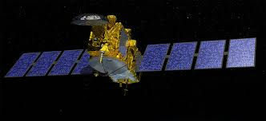

> __Customer__\: Centre National d'Etudes Spatiales (CNES)

> __Programme__\: Mini/Micro-satellites

> __Supply Chain__\: CNES >  CS Group SPACE

# Context

CS Group responsabilities for LEO - Orbitography Support are as follows:
* Full delegation of space mechanics operations

The features are as follows:
* Monitoring of routinely tasks of operational orbital mechanics 
* Contribution to the technical recipes for the validation of anomaly corrections and/or evolutions concerning G2.
* Participation in the operational qualifications needed in order to validate the delivery of a new G2 version.
* Writing of operational procedures.
* Participation at GCO, REDEM (Mission reviews), RETEX (Exploitation reviews)
* Preparation and participation in service withdrawal operations 
* End-of-life operations preparation 
* Development and maintenance of auxiliary tools

# Project implementation

The project objectives are as follows:
* Exploitation of the G2 (one per satellite) mainly responsible of performing orbital mechanic computations and AOCS

The processes for carrying out the project are:
* Operations

# Technical characteristics

The solution key points are as follows:
* Service continuity allowing the computing of hundreds of station keeping manoeuvres.
* Qualified operational support, available for the client requests and responsive to operational emergencies (survival, collision risk …) and to exceptional critic operations as the satellite deorbiting.

The main technologies used in this project are:

{:class="table table-bordered table-dark"}
| Domain | Technology(ies) |
|--------|----------------|
|Hardware environment(s)|PC, X terminal|
|Operating System(s)|Windows 2000, Linux RedHat|
|Programming language(s)|K-Shell, Visual Basic, Perl, Python|
|Production software (IDE, DEVOPS etc.)|G2, Excel, Word, MOLEO, STELA|

{::comment}Abbreviations{:/comment}

*[CLI]: Command Line Interface
*[IaC]: Infrastructure as Code
*[PaaS]: Platform as a Service
*[VM]: Virtual Machine
*[OS]: Operating System
*[IAM]: Identity and Access Management
*[SIEM]: Security Information and Event Management
*[SSO]: Single Sign On
*[IDS]: intrusion detection
*[IPS]: intrusion prevention
*[NSM]: network security monitoring
*[DRMAA]: Distributed Resource Management Application API is a high-level Open Grid Forum API specification for the submission and control of jobs to a Distributed Resource Management (DRM) system, such as a Cluster or Grid computing infrastructure.
