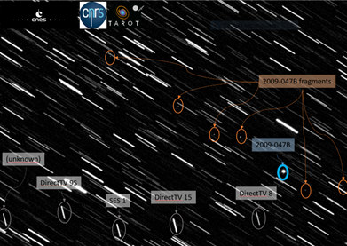
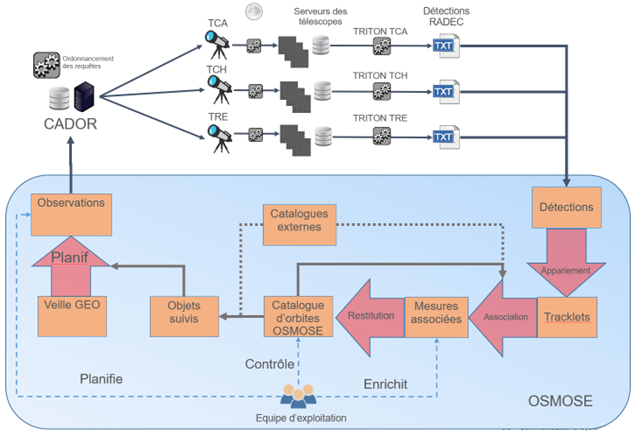

> __Customer__\: Centre National d'Etudes Spatiales (CNES)

> __Programme__\: SSA

> __Supply Chain__\: CNES >  CS Group SPACE

# Context

OSMOSE is used in a European effort to construct an independent orbit catalog in order to assess on its own the space situation and tend towards a safe, regulated and sustainable in-orbit environment

CS Group responsabilities for French Space Surveillance and Tracking Framework are as follows:
* Design, development, intégration, studies, calibrations, maintenance

The features are as follows:
* Main features: 
	* Scheduling of TAROT telescope observations 
	* Measure associations 
	* Orbit computations
	* Maneuver characterization
	* Orbit catalog provision
	* Multi-source data exploitation

# Project implementation

The project objectives are as follows:
* OSMOSE consists in scheduling TAROT telescope network observations and use other european measurements to produce and maintain a GEO orbit catalog

The processes for carrying out the project are:
* Agile

# Technical characteristics

The solution key points are as follows:
* Monolithic, API REST (soon to be removed)

The main technologies used in this project are:

{:class="table table-bordered table-dark"}
| Domain | Technology(ies) |
|--------|----------------|
|Hardware environment(s)|PC (client)|
|Operating System(s)|Linux, Windows (client)|
|Programming language(s)|Java, Python, PostgreSQL|
|Interoperability (protocols, format, APIs)|API REST, CCSDS|
|Production software (IDE, DEVOPS etc.)|Eclipse, IntelliJ, DBeaver, flyway DB, Mockito, Ategui|
|Main COTS library(ies)|PostgreSQL, Patrius, Bibor, Lotus, Ficus|

{::comment}Abbreviations{:/comment}

*[CLI]: Command Line Interface
*[IaC]: Infrastructure as Code
*[PaaS]: Platform as a Service
*[VM]: Virtual Machine
*[OS]: Operating System
*[IAM]: Identity and Access Management
*[SIEM]: Security Information and Event Management
*[SSO]: Single Sign On
*[IDS]: intrusion detection
*[IPS]: intrusion prevention
*[NSM]: network security monitoring
*[DRMAA]: Distributed Resource Management Application API is a high-level Open Grid Forum API specification for the submission and control of jobs to a Distributed Resource Management (DRM) system, such as a Cluster or Grid computing infrastructure.
