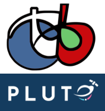

> __Customer__\: Centre National d'Etudes Spatiales (CNES)

> __Programme__\: Generic

> __Supply Chain__\: CNES >  CS Group SPACE

# Context

The PLUTO portal aims to bring together and promote open source satellite image processing tools. It is a community portal open to user contributions.
It thus groups together various resources (description for tools, tutorials), or points to existing resources if existing.
In addition to the development of the portal, the project aims to develop some of the tools presented on PLUTO in order to make them more mature or to offer missing functionalities, to promote their use alone or in processing chains.
In this context, the OTB being a PLUTO tool, CS GROUP stays in charge of its maintenance. This maintenance was already the responsibility of CS GROUP in the past (renewed activity). 
The OTB (Orfeo Toolbox) is an open source library offering a large number of efficient satellite image processing applications, for optical or radar imagery.

CS Group responsabilities for Development of web portal PLUTO and maintenance of the Orfeo Toolbox are as follows:
* Software Development
* Maintenance
* User Support

The features are as follows:
* PLUTO portal aims to bring together and promote open source satellite image processing tools. Main features are the tools catalog, associated tutorials and a forum. User contributions are welcome.
* The OTB (Orfeo Toolbox) is an open source library offering a large number of efficient satellite image processing applications (optical or radar). See list of features in the Cookbook https://www.orfeo-toolbox.org/CookBook/Applications.html

# Project implementation

The project objectives are as follows:
* Develop the PLUTO portal up to version 2.0 open to the public.
* Create resources for the portal (tool references, tutorials).
* Raise the maturity of some tools highlighted on PLUTO.
* Maintain and develop evolutions for the OTB, as a PLUTO tool.

The processes for carrying out the project are:
* Agile

# Technical characteristics

The solution key points are as follows:
* Website developed with MKDOCS, hosted by the CNES, Source code on the CNES gitlab
* Discourse forum
* OTB on Gitlab Public

The main technologies used in this project are:

{:class="table table-bordered table-dark"}
| Domain | Technology(ies) |
|--------|----------------|
|Operating System(s)|Linux, Windows|
|Programming language(s)|Markdown, JavaScript, HTML, CSS, Python, C++|
|Production software (IDE, DEVOPS etc.)|Git, Docker|
|Main COTS library(ies)|mkdocs, gdal, itk|

{::comment}Abbreviations{:/comment}

*[CLI]: Command Line Interface
*[IaC]: Infrastructure as Code
*[PaaS]: Platform as a Service
*[VM]: Virtual Machine
*[OS]: Operating System
*[IAM]: Identity and Access Management
*[SIEM]: Security Information and Event Management
*[SSO]: Single Sign On
*[IDS]: intrusion detection
*[IPS]: intrusion prevention
*[NSM]: network security monitoring
*[DRMAA]: Distributed Resource Management Application API is a high-level Open Grid Forum API specification for the submission and control of jobs to a Distributed Resource Management (DRM) system, such as a Cluster or Grid computing infrastructure.
