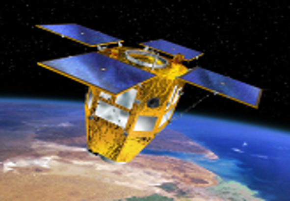

> __Customer__\: Centre National d'Etudes Spatiales (CNES)

> __Programme__\: CSO

> __Supply Chain__\: CNES >  CS Group SPACE

# Context

CS Group responsabilities for MCO OURSON from the CSO programming chain are as follows:
* Maintenance in Operational Conditions

The features are as follows:
* **OURSON** : creation, modification and visualization of Image Quality OTs through a cartographic HMI for the CEQI (Image Quality Center)

# Project implementation

The project objectives are as follows:
* Design and develop the components of the CSO programming chain

The processes for carrying out the project are:
* Continuous integration

# Technical characteristics

The solution key points are as follows:
* Component independence
* Detailed analysis of specifications
* Design led by ecore models,
* Development and maintenance of components with 100% critical code coverage,
* Component validation and cross-validation of critical algorithms
* Product warranty
* User and AIV support

The main technologies used in this project are:

{:class="table table-bordered table-dark"}
| Domain | Technology(ies) |
|--------|----------------|
|Operating System(s)|Linux 64 Bits|
|Programming language(s)|C++, Java, Python, ecore|
|Production software (IDE, DEVOPS etc.)|Développement en intégration continue, Eclipse|
|Main COTS library(ies)|apache, tomcat, log4|

{::comment}Abbreviations{:/comment}

*[CLI]: Command Line Interface
*[IaC]: Infrastructure as Code
*[PaaS]: Platform as a Service
*[VM]: Virtual Machine
*[OS]: Operating System
*[IAM]: Identity and Access Management
*[SIEM]: Security Information and Event Management
*[SSO]: Single Sign On
*[IDS]: intrusion detection
*[IPS]: intrusion prevention
*[NSM]: network security monitoring
*[DRMAA]: Distributed Resource Management Application API is a high-level Open Grid Forum API specification for the submission and control of jobs to a Distributed Resource Management (DRM) system, such as a Cluster or Grid computing infrastructure.
