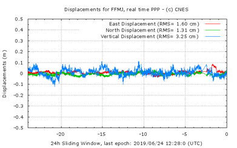

> __Customer__\: Centre National d'Etudes Spatiales (CNES)

> __Programme__\: Generic

> __Supply Chain__\: CNES >  CS Group SPACE

# Context

CS Group responsabilities for Precise Point Positioning with Integer and Zero-difference Ambiguity Resolution are as follows:
* Study, Development, Maintenance

The features are as follows:
* **PPP-Wizard :** Keeping in operative conditions the machines hosted at OVH
* Surveillance of the demonstrator (daily and long-term)
* Algorithm update
* Renting of supplementary machines hosted by OVH according to the Customer needs
	**PPP-User :** Development of new algorithms to increase the user position accuracy (instantaneous detection of the cycle slip, 4th Galileo frequency, BeiDou…), realized with the CNES engineers and experts team
	**Development of 2 applications : RTCM converter and PPP-WizLite**

# Project implementation

The project objectives are as follows:
* Development, maintenance and surveillance of the PPP-WIZARD demonstrator (Precise Point Positioning with Integer and Zero-difference Ambiguity Resolution)
* Development and maintenance of the PPP-WIZARD user client (PPP-User)
* Development of mobile applications based on the PPP-User tool

The processes for carrying out the project are:
* V Cycle

# Technical characteristics

The solution key points are as follows:
* Development of demonstrator with CNES engineers and experts

The main technologies used in this project are:

{:class="table table-bordered table-dark"}
| Domain | Technology(ies) |
|--------|----------------|
|Operating System(s)|Android, Linux|
|Programming language(s)|C++, shell, Python|
|Production software (IDE, DEVOPS etc.)|git|
|Main COTS library(ies)|RTKlib|

{::comment}Abbreviations{:/comment}

*[CLI]: Command Line Interface
*[IaC]: Infrastructure as Code
*[PaaS]: Platform as a Service
*[VM]: Virtual Machine
*[OS]: Operating System
*[IAM]: Identity and Access Management
*[SIEM]: Security Information and Event Management
*[SSO]: Single Sign On
*[IDS]: intrusion detection
*[IPS]: intrusion prevention
*[NSM]: network security monitoring
*[DRMAA]: Distributed Resource Management Application API is a high-level Open Grid Forum API specification for the submission and control of jobs to a Distributed Resource Management (DRM) system, such as a Cluster or Grid computing infrastructure.
